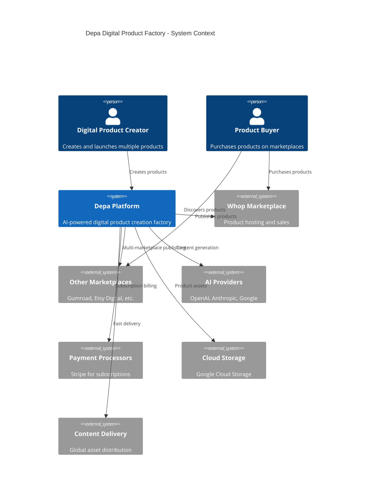

# System Architecture
## Depa - Digital Product Factory Platform

**Version:** 2.0  
**Date:** 2025-09-28  
**Owner:** Claude (Tech Lead)  
**Review Status:** UPDATED FOR PRODUCT FACTORY MODEL  

---

## Architecture Overview

### System Goals
- **Digital Product Factory**: Rapid creation and deployment of multiple digital products
- **Marketplace Integration**: Seamless publishing to Whop and other marketplaces
- **AI-Powered Creation**: Complete product generation through intelligent departments
- **Multi-Product Management**: Handle thousands of products across hundreds of creators
- **Speed Optimization**: <3 days from idea to live marketplace product

### High-Level Architecture (C4 Context)



---

## Container Architecture (C4 Container)

### Frontend Layer

#### Product Factory Dashboard (Next.js 14)
- **Technology**: React 18 + TypeScript + Tailwind CSS
- **Hosting**: Vercel (primary) / GCP Cloud Run (backup)
- **Features**: 
  - Multi-product portfolio management
  - Real-time product creation progress
  - Marketplace integration status
  - Performance analytics dashboard
  - A/B testing and optimization tools

#### Creator Mobile Experience
- **Approach**: Mobile-first responsive web app
- **PWA Features**: Offline product review, push notifications for sales
- **Performance**: <2 second load times, instant navigation
- **Key Features**: Product status monitoring, quick content approval
- **Future**: Native iOS/Android apps for enhanced mobile creation

### Backend Services

#### API Gateway (FastAPI)
- **Technology**: Python 3.11 + FastAPI + Pydantic
- **Hosting**: GCP Cloud Run with auto-scaling
- **Features**:
  - Product creation and management APIs
  - Marketplace integration endpoints
  - JWT authentication for creators
  - Rate limiting per subscription tier
  - Request/response validation
  - Creator analytics and reporting

#### Product Creation Orchestrator
- **Technology**: Python + LangGraph + Redis
- **Purpose**: Coordinates AI departments for complete product creation
- **Features**:
  - End-to-end product generation workflows
  - Content, design, and marketing coordination
  - Quality assurance and review management
  - Marketplace publishing automation
  - Error handling and retry mechanisms

#### Marketplace Integration Service
- **Technology**: Python + aiohttp + asyncio
- **Purpose**: Handle all marketplace API integrations
- **Features**:
  - Whop API integration for primary publishing
  - Multi-marketplace publishing support
  - Product synchronization and updates
  - Sales and analytics data aggregation
  - Compliance and content moderation

#### Real-time Services
- **Technology**: WebSocket server + Redis Pub/Sub
- **Purpose**: Live updates for product creation and performance
- **Features**:
  - Product creation progress tracking
  - Marketplace publishing status
  - Sales notifications and alerts
  - Performance metrics streaming

### Data Layer

#### Primary Database (PostgreSQL 15)
- **Hosting**: GCP Cloud SQL with high availability
- **Size**: Start with 8 vCPU, 32GB RAM, scale for thousands of products
- **Features**:
  - Multi-creator schema design with product isolation
  - Product versioning and history tracking
  - Encrypted at rest and in transit
  - Automated backups with point-in-time recovery
  - Read replicas for analytics and reporting

#### Cache Layer (Redis 7)
- **Hosting**: GCP Memorystore with cluster mode
- **Use Cases**:
  - Product creation session state
  - Marketplace API response caching
  - AI generation result caching
  - Rate limiting per subscription tier
  - Real-time sales and analytics data

#### Vector Database (pgvector)
- **Purpose**: AI embeddings for content intelligence and optimization
- **Use Cases**:
  - Product content similarity analysis
  - Market trend detection and opportunities
  - Content quality scoring
  - Duplicate product detection
  - Creator recommendation system

#### Product Asset Storage
- **Technology**: GCP Cloud Storage with CDN
- **Purpose**: Store and deliver all product files
- **Features**:
  - Multi-format support (PDF, images, videos, templates)
  - Global CDN for fast delivery
  - Automated backup and versioning
  - Secure access controls per marketplace

### External Integrations

#### AI Services
- **Content Generation**: OpenAI GPT-4 for ebooks, courses, and copy
- **Creative Design**: DALL-E 3 + Midjourney for covers and graphics
- **Content Optimization**: Anthropic Claude for quality review and editing
- **Market Analysis**: Google Gemini for trend analysis and optimization
- **Fallback Strategy**: Multi-provider setup for reliability

#### Marketplace APIs
- **Primary**: Whop API for product creation, management, and analytics
- **Secondary**: Gumroad API for additional distribution
- **Future**: Etsy Digital, Shopify, and other marketplace integrations
- **Features**: Automated publishing, sales tracking, customer management

#### Supporting Services
- **Email**: SendGrid for creator notifications and customer communications
- **Analytics**: Google Analytics for product performance tracking
- **Monitoring**: DataDog for system health and performance
- **Security**: Auth0 for creator authentication and authorization

#### Payment Processing
- **Creator Subscriptions**: Stripe for global subscription billing
- **Product Sales**: Handled by marketplace partners (Whop, Gumroad)
- **Features**: Tiered subscription management, usage tracking, billing automation

---

## Component Architecture (C4 Component)

### API Gateway Components

```typescript
// Core API structure
interface APIGateway {
  authentication: AuthMiddleware;
  rateLimiting: RateLimiter;
  routing: Router;
  validation: RequestValidator;
  monitoring: MetricsCollector;
}

interface AuthMiddleware {
  jwtVerification: (token: string) => UserClaims;
  tenantIsolation: (userId: string) => OrganizationId;
  roleBasedAccess: (user: UserClaims, resource: string) => boolean;
}
```

#### Auth & Tenant Management
- **JWT tokens**: 15-minute access + 7-day refresh
- **Multi-tenancy**: Organization-scoped data access
- **RBAC**: Owner, Admin, Member roles per organization
- **Session management**: Redis-backed with sliding expiration

#### API Endpoints Structure
```
/api/v1/
├── auth/                 # Creator authentication & user management
├── creators/             # Creator profile and preferences
├── products/             # Product creation, management, and versioning
├── departments/          # AI department coordination and status
├── marketplaces/         # Marketplace integration and publishing
├── analytics/            # Product performance and creator insights
├── assets/               # Product file management and delivery
├── billing/              # Subscription & payment management
├── workflows/            # Product creation workflow management
└── webhooks/             # Marketplace and service callbacks
```

### Department Orchestrator Components

#### Product Creation Engine
```python
class ProductOrchestrator:
    def __init__(self):
        self.department_registry = DepartmentRegistry()
        self.workflow_engine = LangGraphWorkflow()
        self.state_manager = RedisStateManager()
        self.marketplace_integrator = MarketplaceIntegrator()
        self.quality_assurance = QualityAssurance()
    
    async def create_digital_product(
        self, 
        creator_id: str, 
        product_concept: ProductConcept
    ) -> ProductCreationResult:
        # Orchestrate departments for complete product creation
        workflow = await self.build_product_workflow(product_concept)
        result = await self.workflow_engine.execute(workflow)
        return await self.quality_assurance.review(result)
```

#### AI Departments for Product Creation

**Content Creation Department:**
- `EbookAuthorAgent`: Research, writing, and formatting complete ebooks
- `CourseCreatorAgent`: Structured lesson creation with assignments
- `TemplateDesignerAgent`: Business templates and worksheets
- `CommunityManagerAgent`: Discussion prompts and engagement content

**Marketing & Launch Department:**
- `CopywriterAgent`: Sales pages, product descriptions, marketing copy
- `SEOAgent`: Keyword optimization and search visibility
- `CampaignManagerAgent`: Launch sequences and promotional materials
- `AnalyticsAgent`: Performance tracking and optimization suggestions

**Design Department:**
- `CoverDesignerAgent`: Product covers and thumbnails
- `BrandingAgent`: Visual consistency and style guidelines
- `UXAgent`: User experience optimization for digital products
- `AssetCreatorAgent`: Supporting graphics and visual elements

### Data Access Layer

#### Repository Pattern Implementation
```python
class CreatorRepository:
    def __init__(self, db: Database, creator_id: str):
        self.db = db
        self.creator_id = creator_id
    
    async def find_products(self, status: str = None) -> List[Product]:
        # Automatic creator filtering on all queries
        query = "SELECT * FROM products WHERE creator_id = $1"
        params = [self.creator_id]
        
        if status:
            query += " AND status = $2"
            params.append(status)
            
        return await self.db.query(query, *params)
```

#### Database Schema Design
```sql
-- Product factory schema
CREATE SCHEMA IF NOT EXISTS depa;

-- Core creator management
CREATE TABLE depa.creators (
    id UUID PRIMARY KEY DEFAULT gen_random_uuid(),
    email VARCHAR(255) UNIQUE NOT NULL,
    name VARCHAR(255) NOT NULL,
    subscription_tier VARCHAR(50) DEFAULT 'creator',
    created_at TIMESTAMP WITH TIME ZONE DEFAULT NOW(),
    updated_at TIMESTAMP WITH TIME ZONE DEFAULT NOW()
);

-- Digital products
CREATE TABLE depa.products (
    id UUID PRIMARY KEY DEFAULT gen_random_uuid(),
    creator_id UUID NOT NULL REFERENCES depa.creators(id),
    title VARCHAR(255) NOT NULL,
    type VARCHAR(50) NOT NULL, -- 'ebook', 'course', 'template', 'community'
    status VARCHAR(20) DEFAULT 'draft', -- 'draft', 'generating', 'review', 'published'
    content JSONB NOT NULL DEFAULT '{}',
    marketplace_data JSONB DEFAULT '{}',
    performance_metrics JSONB DEFAULT '{}',
    created_at TIMESTAMP WITH TIME ZONE DEFAULT NOW(),
    published_at TIMESTAMP WITH TIME ZONE
);

-- Product creation workflows
CREATE TABLE depa.workflows (
    id UUID PRIMARY KEY DEFAULT gen_random_uuid(),
    product_id UUID NOT NULL REFERENCES depa.products(id),
    status VARCHAR(20) DEFAULT 'pending',
    current_step VARCHAR(100),
    steps_completed JSONB DEFAULT '[]',
    error_log JSONB DEFAULT '[]',
    created_at TIMESTAMP WITH TIME ZONE DEFAULT NOW()
);
```

---

## Infrastructure Architecture

### Google Cloud Platform Setup

#### Compute Resources
```yaml
# Cloud Run Services
services:
  api-gateway:
    image: gcr.io/project/api-gateway
    cpu: 2
    memory: 4Gi
    min_instances: 2
    max_instances: 100
    concurrency: 100
    
  department-orchestrator:
    image: gcr.io/project/orchestrator
    cpu: 4
    memory: 8Gi
    min_instances: 1
    max_instances: 50
    concurrency: 10
    
  websocket-server:
    image: gcr.io/project/websocket
    cpu: 1
    memory: 2Gi
    min_instances: 1
    max_instances: 10
    concurrency: 1000
```

#### Data Storage
```yaml
# Cloud SQL (PostgreSQL)
database:
  tier: db-custom-4-16384  # 4 vCPU, 16GB RAM
  storage: 100GB SSD
  backup_enabled: true
  point_in_time_recovery: true
  high_availability: true
  
# Memorystore (Redis)
cache:
  tier: M1  # 1GB memory
  auth_enabled: true
  transit_encryption: true
  
# Cloud Storage
storage:
  buckets:
    - user-assets: Multi-regional, public read
    - system-backups: Regional, private
    - ai-models: Regional, private
```

#### Networking & Security
```yaml
# VPC Configuration
network:
  vpc_name: ai-departments-vpc
  subnets:
    - name: web-tier
      cidr: 10.0.1.0/24
      region: us-central1
    - name: app-tier  
      cidr: 10.0.2.0/24
      region: us-central1
    - name: data-tier
      cidr: 10.0.3.0/24
      region: us-central1

# Security
security:
  ssl_certificates: managed
  cloud_armor: enabled
  private_google_access: enabled
  firewall_rules:
    - allow_https_ingress
    - allow_internal_communication
    - deny_all_other
```

### Monitoring & Observability

#### OpenTelemetry Implementation
```python
# Distributed tracing setup
from opentelemetry import trace
from opentelemetry.instrumentation.fastapi import FastAPIInstrumentor
from opentelemetry.instrumentation.asyncpg import AsyncPGInstrumentor

# Auto-instrument FastAPI and database calls
FastAPIInstrumentor.instrument_app(app)
AsyncPGInstrumentor().instrument()

# Custom business metrics
@app.middleware("http")
async def add_business_metrics(request: Request, call_next):
    start_time = time.time()
    response = await call_next(request)
    
    # Track department-specific metrics
    if request.url.path.startswith("/api/v1/departments"):
        department_request_duration.observe(
            time.time() - start_time,
            labels={"department": extract_department_type(request)}
        )
    
    return response
```

#### Key Metrics & Alerts
```yaml
# SLI/SLO Monitoring
metrics:
  api_latency:
    sli: 95th percentile response time
    slo: <500ms for 99% of requests
    alert_threshold: >1000ms for 5 minutes
    
  department_execution:
    sli: Time from trigger to completion
    slo: <8 seconds for content generation
    alert_threshold: >15 seconds for 3 minutes
    
  ai_model_availability:
    sli: Successful AI API calls
    slo: >99% success rate
    alert_threshold: <95% success for 2 minutes
    
  customer_impact:
    sli: End-to-end workflow success
    slo: >98% successful completions
    alert_threshold: <95% success for 5 minutes
```

---

## Security Architecture

### Authentication & Authorization

#### JWT Implementation
```python
# JWT token structure
class TokenClaims:
    user_id: str
    organization_id: str
    roles: List[str]
    permissions: List[str]
    iat: int  # issued at
    exp: int  # expires at
    aud: str = "ai-departments-platform"
    iss: str = "api.aidepartments.com"

# RBAC enforcement
class PermissionMiddleware:
    async def check_permissions(
        self, 
        user: TokenClaims, 
        resource: str, 
        action: str
    ) -> bool:
        # Check user roles and explicit permissions
        required_permission = f"{resource}:{action}"
        return (
            required_permission in user.permissions or
            self.role_has_permission(user.roles, required_permission)
        )
```

#### Data Isolation Strategy
```sql
-- Row-level security for multi-tenancy
ALTER TABLE platform.departments ENABLE ROW LEVEL SECURITY;

CREATE POLICY tenant_isolation ON platform.departments
    FOR ALL TO application_role
    USING (organization_id = current_setting('app.current_organization')::UUID);

-- Set tenant context in each request
SET app.current_organization = '{organization_id}';
```

### Data Protection

#### Encryption Strategy
- **Data at Rest**: AES-256 encryption for all databases and storage
- **Data in Transit**: TLS 1.3 for all API communications
- **Application Secrets**: GCP Secret Manager with automatic rotation
- **Customer Data**: Field-level encryption for sensitive information

#### Privacy & Compliance (LGPD)
```python
class DataPrivacyManager:
    def __init__(self):
        self.encryption_key = self.get_organization_key()
        self.audit_logger = AuditLogger()
    
    async def store_sensitive_data(
        self, 
        data: SensitiveData, 
        legal_basis: LGPDLegalBasis
    ) -> str:
        # Encrypt and audit all sensitive data storage
        encrypted_data = self.encrypt(data)
        await self.audit_logger.log_data_processing(
            action="store",
            data_type=data.type,
            legal_basis=legal_basis,
            retention_period=self.calculate_retention(data.type)
        )
        return await self.store(encrypted_data)
```

---

## Performance & Scalability

### Scaling Strategy

#### Horizontal Scaling
- **API Gateway**: Auto-scale based on CPU and request rate
- **Department Orchestrator**: Scale based on queue depth
- **WebSocket Server**: Scale based on concurrent connections
- **Database**: Read replicas for analytics, connection pooling

#### Caching Strategy
```python
# Multi-level caching
class CacheManager:
    def __init__(self):
        self.l1_cache = InMemoryCache(ttl=60)  # Fast, local
        self.l2_cache = RedisCache(ttl=3600)   # Shared, durable
        self.l3_cache = CDNCache(ttl=86400)    # Global, static
    
    async def get_cached_response(self, key: str) -> Optional[dict]:
        # Check caches in order of speed
        if value := await self.l1_cache.get(key):
            return value
        if value := await self.l2_cache.get(key):
            await self.l1_cache.set(key, value)
            return value
        return None
```

#### Performance Targets
```yaml
# Performance SLAs
performance_targets:
  api_response_time:
    p50: <200ms
    p95: <500ms
    p99: <1000ms
    
  page_load_time:
    first_contentful_paint: <1.5s
    largest_contentful_paint: <2.5s
    cumulative_layout_shift: <0.1
    
  ai_generation_time:
    social_post: <8s
    whatsapp_response: <3s
    image_generation: <15s
    
  database_query_time:
    simple_queries: <10ms
    complex_queries: <100ms
    analytics_queries: <1000ms
```

### Queue Management

#### Asynchronous Processing
```python
# Background job processing
class DepartmentJobQueue:
    def __init__(self):
        self.redis = Redis()
        self.workers = []
    
    async def enqueue_content_generation(
        self, 
        department_id: str, 
        prompt: str, 
        priority: JobPriority = JobPriority.NORMAL
    ) -> JobId:
        job = ContentGenerationJob(
            department_id=department_id,
            prompt=prompt,
            priority=priority,
            created_at=datetime.utcnow()
        )
        
        queue_name = f"content_generation_{priority.value}"
        await self.redis.lpush(queue_name, job.serialize())
        return job.id
```

---

## Disaster Recovery & Business Continuity

### Backup Strategy
```yaml
# Automated backup configuration
backup_strategy:
  database:
    frequency: every_6_hours
    retention: 30_days
    cross_region: true
    encryption: enabled
    
  file_storage:
    frequency: daily
    retention: 90_days
    versioning: enabled
    lifecycle: archive_after_30_days
    
  application_state:
    frequency: real_time
    method: redis_persistence
    backup_frequency: hourly
```

### Failover Procedures
```yaml
# Multi-region disaster recovery
disaster_recovery:
  rpo: 1_hour  # Maximum data loss
  rto: 30_minutes  # Maximum downtime
  
  primary_region: us-central1
  backup_region: us-east1
  
  failover_triggers:
    - region_wide_outage
    - database_corruption
    - security_breach
    
  automated_failover:
    enabled: true
    health_check_interval: 30s
    failure_threshold: 3_consecutive_failures
```

### Monitoring & Alerting
```yaml
# Critical system monitoring
alerts:
  severity_levels:
    critical:
      response_time: immediate
      escalation: 5_minutes
      channels: [pagerduty, slack, sms]
      
    warning:
      response_time: 15_minutes
      escalation: 30_minutes
      channels: [slack, email]
      
  alert_conditions:
    - name: api_gateway_down
      condition: http_success_rate < 95%
      duration: 2_minutes
      severity: critical
      
    - name: high_ai_latency
      condition: ai_response_time > 15_seconds
      duration: 5_minutes
      severity: warning
      
    - name: database_connection_pool_exhausted
      condition: db_active_connections > 80%
      duration: 1_minute
      severity: critical
```

---

## Development & Deployment

### Environment Strategy
```yaml
# Multi-environment setup
environments:
  development:
    purpose: Local development and testing
    resources: minimal
    data: synthetic
    ai_models: development_tier
    
  staging:
    purpose: Integration testing and demos
    resources: production_like
    data: anonymized_production_subset
    ai_models: production_tier
    
  production:
    purpose: Live customer workloads
    resources: auto_scaling
    data: encrypted_customer_data
    ai_models: production_tier
    monitoring: full_observability
```

### CI/CD Pipeline
```yaml
# GitHub Actions workflow
deployment_pipeline:
  triggers:
    - push_to_main
    - pull_request_approved
    - manual_deployment
    
  stages:
    1_code_quality:
      - lint_check
      - type_check
      - security_scan
      - dependency_audit
      
    2_testing:
      - unit_tests
      - integration_tests
      - e2e_tests
      - performance_tests
      
    3_build:
      - docker_build
      - vulnerability_scan
      - registry_push
      
    4_deploy:
      - staging_deployment
      - smoke_tests
      - production_deployment
      - health_checks
```

---

## Technology Decisions & Rationale

### Framework Choices

#### Frontend: Next.js 14
**Rationale:**
- Server-side rendering for SEO and performance
- React ecosystem for rich interactivity
- Built-in optimization and deployment
- Strong TypeScript support

#### Backend: FastAPI
**Rationale:**
- Async/await native support for high concurrency
- Automatic OpenAPI documentation
- Built-in validation with Pydantic
- High performance compared to Django/Flask

#### Database: PostgreSQL + Redis
**Rationale:**
- PostgreSQL: ACID compliance, complex queries, JSON support
- Redis: Fast caching, pub/sub, session storage
- pgvector: Native vector operations for AI embeddings

#### AI Orchestration: LangGraph
**Rationale:**
- Multi-agent coordination capabilities
- State management across complex workflows
- Integration with major AI providers
- Python ecosystem compatibility

### Cloud Provider: Google Cloud Platform
**Rationale:**
- Strong AI/ML services integration
- Cost-effective for our scale
- Excellent auto-scaling capabilities
- Robust security and compliance features
- Good performance in Brazil/LATAM

---

**Document Status:** Architecture approved for MVP implementation. Review quarterly for scaling adjustments.