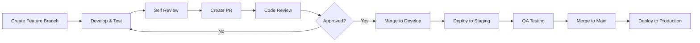

# Contributing Guide
## AI Departments Platform

**Version:** 1.0  
**Last Updated:** 2025-09-13  
**Owner:** Claude (Technical Lead)  
**Status:** ACTIVE  

---

## Overview

This document defines the development workflow, standards, and processes for Claude AI contributions to the AI Departments Platform. It establishes clear guidelines for branch management, commit conventions, pull request templates, and definition of done criteria.

---

## 1. Development Workflow

### 1.1 Branch Strategy

**Main Branches:**
- `main`: Production-ready code, always deployable
- `develop`: Integration branch for features, always in working state
- `staging`: Pre-production testing environment

**Feature Branches:**
- `feature/[area]/[description]` - New features (e.g., `feature/marketing/social-scheduler`)
- `fix/[area]/[description]` - Bug fixes (e.g., `fix/auth/login-validation`)
- `docs/[description]` - Documentation updates (e.g., `docs/api-specs`)
- `infra/[description]` - Infrastructure changes (e.g., `infra/gcp-deployment`)

**Branch Naming Conventions:**
- Use lowercase with hyphens
- Include area/domain prefix for context
- Keep descriptions concise but descriptive
- Maximum 50 characters total

### 1.2 Feature Development Lifecycle



### 1.3 Commit Convention

**Format:** `<type>(<scope>): <description>`

**Types:**
- `feat`: New feature
- `fix`: Bug fix
- `docs`: Documentation only changes
- `style`: Code style changes (formatting, semicolons, etc.)
- `refactor`: Code refactoring without feature changes
- `test`: Adding or modifying tests
- `chore`: Maintenance tasks (dependencies, build, etc.)
- `perf`: Performance improvements
- `ci`: CI/CD pipeline changes

**Scopes (optional):**
- `auth`: Authentication/authorization
- `marketing`: Marketing department features
- `cx`: Customer service features
- `db`: Database changes
- `api`: API changes
- `ui`: User interface changes
- `infra`: Infrastructure

**Examples:**
```bash
feat(marketing): add social media post scheduler
fix(auth): resolve login redirect loop
docs(api): update OpenAPI specifications
refactor(db): optimize user query performance
test(cx): add WhatsApp integration tests
```

**Commit Message Rules:**
- Use imperative mood ("add" not "added")
- First line max 72 characters
- Capitalize first letter
- No period at the end of first line
- Add body for complex changes (why, not what)

---

## 2. Pull Request Process

### 2.1 PR Template

```markdown
## Description
Brief description of changes and motivation.

## Type of Change
- [ ] Bug fix (non-breaking change which fixes an issue)
- [ ] New feature (non-breaking change which adds functionality)
- [ ] Breaking change (fix or feature that would cause existing functionality to not work as expected)
- [ ] Documentation update

## Department/Area
- [ ] Marketing Department
- [ ] Customer Service Department
- [ ] Authentication/Authorization
- [ ] Infrastructure/DevOps
- [ ] Documentation
- [ ] Other: ___________

## Testing
- [ ] Unit tests pass
- [ ] Integration tests pass
- [ ] E2E tests pass (if applicable)
- [ ] Manual testing completed
- [ ] Performance impact assessed

## Checklist
- [ ] Code follows project coding standards
- [ ] Self-review completed
- [ ] Documentation updated (if needed)
- [ ] No sensitive data exposed
- [ ] Breaking changes documented
- [ ] PR title follows conventional commits format

## Screenshots (if UI changes)
[Add screenshots or GIFs demonstrating the changes]

## Additional Notes
[Any additional context, concerns, or discussion points]
```

### 2.2 PR Labels

**Priority:**
- `priority/critical` - Security issues, production outages
- `priority/high` - Important features, significant bugs
- `priority/medium` - Regular features, minor bugs
- `priority/low` - Nice-to-have improvements

**Type:**
- `type/feature` - New functionality
- `type/bugfix` - Bug fixes
- `type/enhancement` - Improvements to existing features
- `type/refactor` - Code refactoring
- `type/docs` - Documentation changes
- `type/infra` - Infrastructure changes

**Department:**
- `dept/marketing` - Marketing department related
- `dept/cx` - Customer service related
- `dept/auth` - Authentication/authorization
- `dept/infra` - Infrastructure/DevOps

**Status:**
- `status/draft` - Work in progress
- `status/review` - Ready for review
- `status/approved` - Approved, waiting for merge
- `status/blocked` - Blocked by dependencies

**Size:**
- `size/xs` - <10 lines changed
- `size/s` - 10-100 lines changed
- `size/m` - 100-500 lines changed
- `size/l` - 500-1000 lines changed
- `size/xl` - >1000 lines changed

### 2.3 Review Process

**Review Requirements:**
- All PRs require at least 1 approval
- Breaking changes require 2 approvals
- Infrastructure changes require Felipe PM approval
- Security-related changes require security review

**Review Checklist:**
- [ ] Code quality and readability
- [ ] Performance implications
- [ ] Security considerations
- [ ] Test coverage adequacy
- [ ] Documentation completeness
- [ ] LGPD compliance (for data handling)
- [ ] Error handling and edge cases

---

## 3. Definition of Done (DoD)

### 3.1 Feature DoD

**Development:**
- [ ] Feature implemented according to acceptance criteria
- [ ] Code follows coding standards (see CODING_STANDARDS.md)
- [ ] Unit tests written and passing (>80% coverage)
- [ ] Integration tests passing
- [ ] Error handling implemented
- [ ] Logging added for debugging
- [ ] Performance acceptable (<SLO thresholds)

**Quality Assurance:**
- [ ] Manual testing completed
- [ ] Cross-browser testing (Chrome, Firefox, Safari, Edge)
- [ ] Mobile responsiveness verified
- [ ] Accessibility requirements met (WCAG 2.1 AA)
- [ ] Security review completed (if applicable)

**Documentation:**
- [ ] API documentation updated (if applicable)
- [ ] User documentation updated (if applicable)
- [ ] Code comments added for complex logic
- [ ] README updated (if applicable)

**Deployment:**
- [ ] Environment variables documented
- [ ] Database migrations tested
- [ ] Deployment script updated (if needed)
- [ ] Monitoring/alerting configured
- [ ] Rollback plan documented

### 3.2 Bug Fix DoD

**Resolution:**
- [ ] Root cause identified and documented
- [ ] Fix implemented and tested
- [ ] Regression tests added
- [ ] No new bugs introduced

**Prevention:**
- [ ] Automated tests added to prevent regression
- [ ] Code review identifies similar patterns
- [ ] Documentation updated to prevent similar issues

---

## 4. Code Review Guidelines

### 4.1 What to Review

**Functionality:**
- Does the code do what it's supposed to do?
- Are edge cases handled properly?
- Is error handling adequate?

**Code Quality:**
- Is the code readable and maintainable?
- Are functions and variables well-named?
- Is the code DRY (Don't Repeat Yourself)?
- Is the complexity appropriate?

**Performance:**
- Are there any obvious performance issues?
- Are database queries optimized?
- Is caching used appropriately?

**Security:**
- Are there any security vulnerabilities?
- Is user input properly validated?
- Are secrets properly handled?

### 4.2 Review Comments

**Constructive Feedback:**
- Be specific about what needs to change
- Suggest alternatives when possible
- Explain the reasoning behind feedback
- Be respectful and collaborative

**Comment Categories:**
- `nit:` - Minor style/preference issues
- `question:` - Seeking clarification
- `suggestion:` - Optional improvements
- `issue:` - Must be addressed before merge
- `praise:` - Positive feedback for good code

---

## 5. Continuous Integration

### 5.1 CI Pipeline Stages

1. **Code Quality:**
   - Linting (ESLint, Flake8)
   - Formatting (Prettier, Black)
   - Type checking (TypeScript, mypy)

2. **Testing:**
   - Unit tests
   - Integration tests
   - End-to-end tests (on main branches)

3. **Security:**
   - Dependency vulnerability scanning
   - SAST (Static Application Security Testing)
   - Secrets detection

4. **Build & Deploy:**
   - Application build
   - Docker image creation
   - Deployment to appropriate environment

### 5.2 Branch Protection Rules

**Main Branch:**
- Require PR before merging
- Require status checks to pass
- Require up-to-date branches
- Require conversation resolution
- Restrict pushes to admins only

**Develop Branch:**
- Require PR before merging
- Require status checks to pass
- Allow force pushes (with caution)

---

## 6. Release Process

### 6.1 Versioning

**Semantic Versioning (SemVer):**
- `MAJOR.MINOR.PATCH` (e.g., `1.2.3`)
- **MAJOR**: Breaking changes
- **MINOR**: New features (backward compatible)
- **PATCH**: Bug fixes (backward compatible)

**Pre-release versions:**
- `1.2.3-alpha.1` - Alpha releases
- `1.2.3-beta.1` - Beta releases
- `1.2.3-rc.1` - Release candidates

### 6.2 Release Checklist

**Pre-release:**
- [ ] All features tested and approved
- [ ] Documentation updated
- [ ] Migration scripts tested
- [ ] Rollback plan prepared
- [ ] Monitoring alerts configured

**Release:**
- [ ] Tag created with appropriate version
- [ ] Release notes published
- [ ] Deployment completed
- [ ] Smoke tests passed
- [ ] Stakeholders notified

**Post-release:**
- [ ] Monitoring dashboards checked
- [ ] Error rates within normal bounds
- [ ] Performance metrics acceptable
- [ ] User feedback collected

---

## 7. Emergency Procedures

### 7.1 Hotfix Process

For critical production issues:

1. **Immediate Response:**
   - Create hotfix branch from `main`
   - Implement minimal fix
   - Test thoroughly
   - Deploy to staging first (if time permits)

2. **Fast-track Review:**
   - Single reviewer approval sufficient
   - Focus on fixing the issue, not perfection
   - Deploy to production immediately

3. **Follow-up:**
   - Create proper fix/refactor if needed
   - Update tests and documentation
   - Conduct post-mortem analysis

### 7.2 Rollback Procedures

**Automated Rollback:**
- Triggered by monitoring alerts
- Previous stable version deployed automatically
- Incident response team notified

**Manual Rollback:**
- Revert to previous tag/commit
- Update database if needed
- Verify functionality restored

---

## 8. Communication

### 8.1 Development Updates

**Daily:**
- Progress updates in PR comments
- Blocker identification and resolution

**Weekly:**
- Development summary
- Upcoming priorities
- Risk identification

### 8.2 Escalation Path

1. **Technical Issues:** Claude → Felipe PM
2. **Business Decisions:** Felipe PM
3. **Critical Issues:** Immediate escalation to Felipe PM

---

## 9. Tools and Automation

### 9.1 Required Tools

**Development:**
- Git
- Docker
- Node.js 18+
- Python 3.11+
- PostgreSQL 15+
- Redis 7+

**Code Quality:**
- ESLint + Prettier (Frontend)
- Flake8 + Black (Backend)
- TypeScript
- Pre-commit hooks

### 9.2 Automation

**Pre-commit Hooks:**
- Code formatting
- Linting
- Test execution
- Security scanning

**CI/CD:**
- GitHub Actions
- Automated testing
- Deployment pipelines
- Monitoring integration

---

## 10. Decision Records

### Decisions Made:

1. **Branch Strategy:** Git Flow with develop/staging/main branches
2. **Commit Convention:** Conventional Commits with department scopes
3. **Review Process:** Single reviewer for regular changes, two for breaking changes
4. **CI/CD:** GitHub Actions with automated testing and deployment
5. **Versioning:** Semantic versioning with pre-release support

### Future Considerations:

- Implement automated dependency updates
- Add performance regression testing
- Consider feature flags for complex rollouts
- Evaluate code coverage requirements

---

**Document Status:** Active and ready for implementation. All developers must follow these guidelines for consistent collaboration.