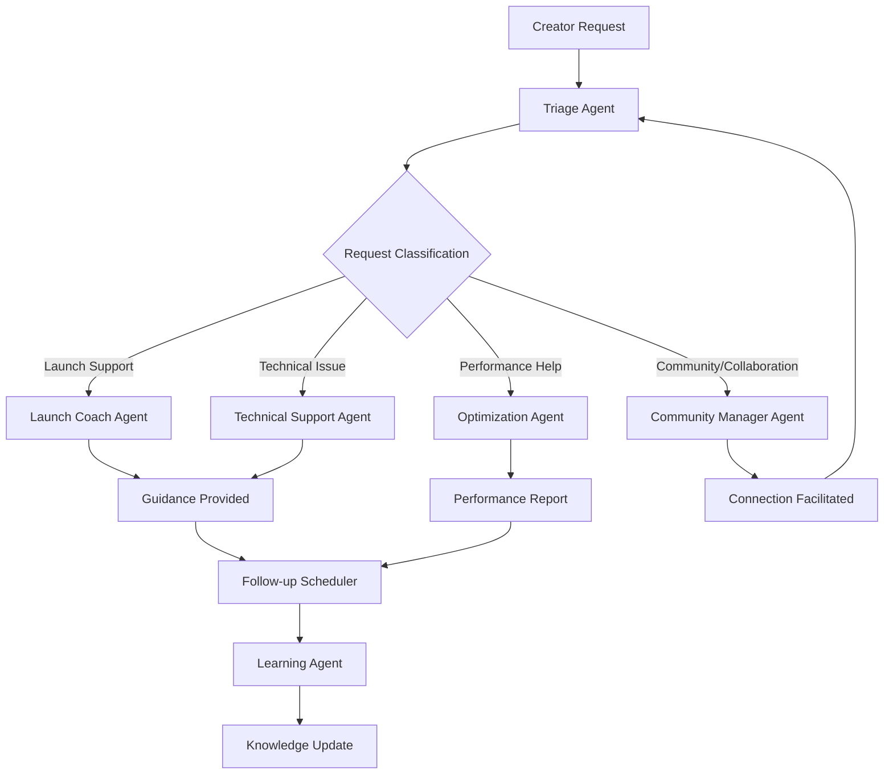

# Creator Success Department Specification
## Depa - Digital Product Factory Platform

**Version:** 2.0  
**Date:** 2025-09-28  
**Owner:** Felipe PM + Claude AI  
**Department Type:** Creator Success (CS)  
**Status:** UPDATED FOR DIGITAL PRODUCT FACTORY MODEL  

---

## Department Overview

### Mission Statement
Provide comprehensive support and guidance to digital product creators throughout their journey from product creation to successful marketplace performance, ensuring high creator satisfaction and product success rates.

### Core Value Proposition
- **Launch Support**: End-to-end guidance for successful product launches
- **Performance Optimization**: Data-driven recommendations for product improvement
- **Community Building**: Creator networking and collaboration facilitation
- **Technical Assistance**: Platform and integration support
- **Success Coaching**: Personalized guidance for creator growth

### Success Metrics
- **Creator Retention**: >85% of creators active after 90 days
- **Product Success Rate**: >20% of launched products generate $100+ in first month
- **Support Response Time**: <2 hours for creator inquiries
- **Creator Satisfaction**: >4.5/5.0 rating for support experience

---

## Agent Architecture

### Agent Hierarchy & Coordination



### 1. Intake Agent (Entry Point)

#### Responsibilities
- First point of contact for all customer messages
- Basic message preprocessing and context gathering
- Route to appropriate specialist agent
- Maintain conversation state and history

#### Configuration
```python
class IntakeAgent:
    def __init__(self, organization_config: OrgConfig):
        self.business_hours = organization_config.business_hours
        self.greeting_style = organization_config.tone  # formal, casual, friendly
        self.escalation_triggers = organization_config.escalation_rules
        self.context_memory = ConversationMemory(ttl=24_hours)
    
    async def process_message(self, message: CustomerMessage) -> AgentRouting:
        # Gather context from previous conversations
        context = await self.context_memory.get_conversation_history(
            customer_id=message.customer_id,
            lookback_hours=24
        )
        
        # Basic message analysis
        analysis = await self.analyze_message(message, context)
        
        # Route to appropriate agent
        return self.route_message(analysis)
```

#### Routing Logic
```python
def route_message(self, analysis: MessageAnalysis) -> AgentRouting:
    if analysis.urgency_level == "critical":
        return EscalationAgent(priority="high")
    elif analysis.intent in ["faq", "hours", "location", "general_info"]:
        return FAQAgent()
    elif analysis.intent in ["order_status", "delivery", "payment"]:
        return OrderAgent()
    elif analysis.sentiment == "negative" and analysis.confidence > 0.8:
        return EscalationAgent(priority="medium")
    else:
        return ClarificationAgent()
```

#### Performance SLAs
- **Processing Time**: <500ms for routing decision
- **Accuracy**: >95% correct agent routing
- **Context Retention**: 24-hour conversation memory
- **Uptime**: 99.9% availability

### 2. FAQ Agent (Knowledge Base)

#### Responsibilities
- Answer frequently asked questions using company knowledge base
- Provide consistent, accurate information about business
- Handle standard inquiries (hours, location, services, pricing)
- Update knowledge base based on new information

#### Knowledge Base Structure
```yaml
# Company Knowledge Base Schema
knowledge_base:
  business_info:
    name: "Marina's Fashion"
    hours: "Segunda a Sexta: 9h às 18h"
    location: "São Paulo, SP"
    delivery_areas: ["Grande São Paulo", "ABC"]
    
  products:
    categories: ["Vestidos", "Blusas", "Acessórios"]
    price_range: "R$ 50 - R$ 300"
    customization: true
    
  policies:
    return_policy: "7 dias para troca/devolução"
    payment_methods: ["PIX", "Cartão", "Boleto"]
    shipping_time: "3-5 dias úteis"
    
  faq:
    - question: "Vocês entregam em toda São Paulo?"
      answer: "Sim! Entregamos em toda a Grande São Paulo e região do ABC."
      keywords: ["entrega", "delivery", "são paulo", "abc"]
      
    - question: "Qual o prazo de entrega?"
      answer: "O prazo é de 3 a 5 dias úteis após a confirmação do pagamento."
      keywords: ["prazo", "entrega", "tempo", "quando chega"]
```

#### Response Generation
```python
class FAQAgent:
    def __init__(self, knowledge_base: KnowledgeBase):
        self.kb = knowledge_base
        self.embedding_model = OpenAIEmbeddings()
        self.vector_store = PineconeVectorStore()
        
    async def generate_response(
        self, 
        question: str, 
        context: ConversationContext
    ) -> AgentResponse:
        # Find most relevant FAQ entries
        relevant_faqs = await self.find_relevant_faqs(question)
        
        if relevant_faqs and relevant_faqs[0].confidence > 0.85:
            # High confidence - direct FAQ answer
            base_answer = relevant_faqs[0].answer
            
            # Personalize response with company tone
            personalized_answer = await self.personalize_response(
                base_answer=base_answer,
                customer_name=context.customer_name,
                conversation_tone=context.preferred_tone
            )
            
            return AgentResponse(
                text=personalized_answer,
                confidence=relevant_faqs[0].confidence,
                sources=[relevant_faqs[0].id],
                suggested_actions=self.extract_actions(base_answer)
            )
        else:
            # Low confidence - escalate or clarify
            return self.handle_low_confidence(question, context)
```

#### Learning & Updates
```python
class KnowledgeBaseUpdater:
    async def update_from_human_corrections(
        self, 
        original_question: str,
        ai_answer: str,
        human_correction: str,
        approval_status: bool
    ):
        if approval_status:
            # AI answer was good - reinforce
            await self.reinforce_answer(original_question, ai_answer)
        else:
            # AI answer was corrected - learn from human
            await self.add_corrected_answer(
                question=original_question,
                correct_answer=human_correction,
                wrong_answer=ai_answer
            )
            
    async def identify_knowledge_gaps(self) -> List[KnowledgeGap]:
        # Analyze frequent escalations to identify missing FAQs
        frequent_escalations = await self.get_escalation_patterns()
        return [
            KnowledgeGap(
                topic=pattern.common_theme,
                frequency=pattern.occurrence_count,
                suggested_faq=pattern.potential_answer
            )
            for pattern in frequent_escalations
            if pattern.occurrence_count > 5
        ]
```

### 3. Order Agent (Transaction Support)

#### Responsibilities
- Handle order-related inquiries (status, tracking, changes)
- Process payment questions and issues
- Manage delivery and shipping concerns
- Coordinate with inventory and fulfillment systems

#### Order Management Integration
```python
class OrderAgent:
    def __init__(self, order_system: OrderManagementSystem):
        self.order_system = order_system
        self.payment_processor = PaymentProcessor()
        self.shipping_tracker = ShippingTracker()
        
    async def handle_order_inquiry(
        self, 
        customer_id: str, 
        inquiry_type: str, 
        order_reference: Optional[str] = None
    ) -> AgentResponse:
        
        # Find customer's orders
        customer_orders = await self.order_system.get_customer_orders(
            customer_id=customer_id,
            limit=5,
            status=["pending", "processing", "shipped"]
        )
        
        if inquiry_type == "order_status":
            return await self.provide_order_status(customer_orders, order_reference)
        elif inquiry_type == "payment_issue":
            return await self.handle_payment_inquiry(customer_orders)
        elif inquiry_type == "delivery_question":
            return await self.provide_delivery_info(customer_orders)
        elif inquiry_type == "order_change":
            return await self.handle_order_modification(customer_orders)
```

#### Response Templates
```python
# Order status responses with dynamic content
ORDER_STATUS_TEMPLATES = {
    "pending_payment": """
    Oi {customer_name}! 
    
    Seu pedido #{order_id} está aguardando o pagamento.
    
    📦 Produtos: {product_list}
    💰 Valor: R$ {total_amount}
    ⏰ Prazo para pagamento: {payment_deadline}
    
    {payment_link}
    
    Assim que recebermos o pagamento, começamos a preparar seu pedido! 
    """,
    
    "processing": """
    Oba! Seu pedido #{order_id} está sendo preparado com muito carinho! 
    
    📦 Status: Em preparação
    🚚 Previsão de envio: {shipping_date}
    📱 Vou te avisar quando sair para entrega!
    
    Ansioso(a)? Eu também! ✨
    """,
    
    "shipped": """
    Seu pedido saiu para entrega! 🚚✨
    
    📦 Pedido: #{order_id}
    🚚 Transportadora: {shipping_company}
    📱 Código de rastreamento: {tracking_code}
    📅 Previsão de entrega: {delivery_date}
    
    Acompanhe pelo link: {tracking_link}
    """
}
```

### 4. Escalation Agent (Human Handoff)

#### Responsibilities
- Identify when human intervention is needed
- Properly prepare context for business owner
- Handle urgent or complex situations
- Manage escalation priorities and timing

#### Escalation Triggers
```python
class EscalationTriggers:
    @staticmethod
    def should_escalate(
        message: CustomerMessage, 
        context: ConversationContext,
        sentiment: SentimentAnalysis
    ) -> EscalationDecision:
        
        escalation_score = 0
        reasons = []
        
        # Sentiment-based escalation
        if sentiment.polarity < -0.7:  # Very negative
            escalation_score += 30
            reasons.append("Negative customer sentiment detected")
            
        # Keyword-based escalation
        urgent_keywords = ["urgente", "problema", "reclamação", "advogado", "procon"]
        if any(keyword in message.text.lower() for keyword in urgent_keywords):
            escalation_score += 25
            reasons.append("Urgent keywords detected")
            
        # Conversation length escalation
        if context.message_count > 5 and not context.resolution_achieved:
            escalation_score += 20
            reasons.append("Extended conversation without resolution")
            
        # Time-sensitive escalation
        if context.last_human_message_hours > 4 and sentiment.polarity < -0.3:
            escalation_score += 15
            reasons.append("Delayed response to negative customer")
            
        # Confidence-based escalation
        if context.last_ai_confidence < 0.6:
            escalation_score += 10
            reasons.append("Low AI confidence in handling inquiry")
            
        return EscalationDecision(
            should_escalate=escalation_score >= 40,
            priority=calculate_priority(escalation_score),
            reasons=reasons,
            estimated_urgency=escalation_score
        )
```

#### Handoff Preparation
```python
async def prepare_human_handoff(
    self, 
    conversation: ConversationHistory, 
    escalation_reason: str
) -> HandoffPackage:
    
    # Summarize conversation for human
    summary = await self.generate_conversation_summary(conversation)
    
    # Extract key information
    customer_info = await self.extract_customer_details(conversation)
    
    # Suggest response strategies
    suggested_responses = await self.generate_response_suggestions(
        conversation_context=conversation,
        escalation_reason=escalation_reason
    )
    
    return HandoffPackage(
        conversation_summary=summary,
        customer_profile=customer_info,
        escalation_reason=escalation_reason,
        urgency_level=self.calculate_urgency(conversation),
        suggested_responses=suggested_responses,
        context_data=conversation.to_human_readable()
    )
```

#### Business Owner Notification
```python
# WhatsApp notification to business owner
ESCALATION_NOTIFICATION_TEMPLATE = """
🚨 ATENÇÃO: Cliente precisa da sua resposta

👤 Cliente: {customer_name}
📱 Telefone: {customer_phone}
⚠️ Motivo: {escalation_reason}
🕒 Tempo de espera: {waiting_time}

📝 Resumo da conversa:
{conversation_summary}

💡 Sugestões de resposta:
{suggested_responses}

Responda diretamente no chat ou acesse o painel: {dashboard_link}
"""
```

### 5. Sentiment Agent (Emotion Monitoring)

#### Responsibilities
- Monitor customer satisfaction throughout conversations
- Detect escalating frustration or decreasing satisfaction
- Provide real-time feedback to other agents
- Generate customer satisfaction insights

#### Sentiment Analysis Implementation
```python
class SentimentAgent:
    def __init__(self):
        self.sentiment_model = pipeline("sentiment-analysis", 
                                      model="neuralmind/bert-base-portuguese-cased")
        self.emotion_classifier = EmotionClassifier()
        
    async def analyze_message_sentiment(
        self, 
        message: str, 
        conversation_context: ConversationHistory
    ) -> SentimentAnalysis:
        
        # Base sentiment analysis
        sentiment_result = self.sentiment_model(message)
        
        # Context-aware sentiment adjustment
        context_adjustment = self.calculate_context_adjustment(conversation_context)
        
        # Emotion detection
        emotions = await self.emotion_classifier.classify(message)
        
        return SentimentAnalysis(
            polarity=sentiment_result["score"] + context_adjustment,
            confidence=sentiment_result["confidence"],
            primary_emotion=emotions[0],
            trend=self.calculate_sentiment_trend(conversation_context),
            risk_level=self.assess_escalation_risk(sentiment_result, emotions)
        )
```

#### Sentiment-Based Response Adjustment
```python
async def adjust_response_tone(
    self, 
    base_response: str, 
    customer_sentiment: SentimentAnalysis
) -> str:
    
    if customer_sentiment.primary_emotion == "frustrated":
        # Add empathy and acknowledgment
        return await self.add_empathy_layer(base_response)
        
    elif customer_sentiment.primary_emotion == "excited":
        # Match enthusiasm level
        return await self.add_enthusiasm_layer(base_response)
        
    elif customer_sentiment.risk_level == "high":
        # Add de-escalation techniques
        return await self.add_deescalation_layer(base_response)
        
    else:
        # Maintain neutral professional tone
        return base_response
```

### 6. Learning Agent (Continuous Improvement)

#### Responsibilities
- Learn from human corrections and feedback
- Identify knowledge gaps and improvement opportunities
- Optimize response quality over time
- Generate insights for business owners

#### Feedback Loop Implementation
```python
class LearningAgent:
    def __init__(self):
        self.feedback_collector = FeedbackCollector()
        self.pattern_analyzer = ConversationPatternAnalyzer()
        self.knowledge_updater = KnowledgeBaseUpdater()
        
    async def process_human_feedback(
        self, 
        ai_response: str, 
        human_correction: str, 
        conversation_context: ConversationHistory,
        feedback_type: FeedbackType
    ):
        
        # Extract learning signals
        learning_signals = await self.extract_learning_signals(
            original_response=ai_response,
            corrected_response=human_correction,
            context=conversation_context
        )
        
        # Update knowledge base
        if feedback_type == FeedbackType.FACTUAL_CORRECTION:
            await self.knowledge_updater.update_facts(learning_signals)
            
        elif feedback_type == FeedbackType.TONE_ADJUSTMENT:
            await self.update_tone_preferences(learning_signals)
            
        elif feedback_type == FeedbackType.ESCALATION_FEEDBACK:
            await self.adjust_escalation_thresholds(learning_signals)
```

---

## Integration Specifications

### WhatsApp Cloud API Integration

#### Message Handling
```python
class WhatsAppIntegration:
    def __init__(self, access_token: str, phone_number_id: str):
        self.client = WhatsAppCloudAPI(access_token, phone_number_id)
        self.message_parser = WhatsAppMessageParser()
        
    async def handle_incoming_message(self, webhook_data: dict) -> None:
        # Parse incoming message
        message = self.message_parser.parse(webhook_data)
        
        # Send to CX Department for processing
        response = await self.cx_department.process_message(message)
        
        # Send response back to customer
        await self.send_response(message.sender, response)
        
    async def send_response(
        self, 
        recipient: str, 
        response: AgentResponse
    ) -> WhatsAppMessageResult:
        
        if response.message_type == "text":
            return await self.client.send_message(
                to=recipient,
                message_type="text",
                text={"body": response.text}
            )
            
        elif response.message_type == "interactive":
            return await self.client.send_message(
                to=recipient,
                message_type="interactive",
                interactive=response.interactive_content
            )
```

#### Message Types Support
```yaml
# Supported WhatsApp message types
supported_message_types:
  incoming:
    - text: Regular text messages
    - image: Photos with optional captions
    - audio: Voice messages (transcription)
    - document: PDFs, receipts, etc.
    - location: Shared locations
    - contact: Shared contact information
    
  outgoing:
    - text: Regular responses
    - image: Product photos, receipts
    - interactive: Quick reply buttons
    - template: Pre-approved business templates
    - document: Order confirmations, invoices
```

### Social Media Integration

#### Instagram/Facebook Direct Messages
```python
class SocialMediaIntegration:
    def __init__(self):
        self.instagram_client = InstagramGraphAPI()
        self.facebook_client = FacebookGraphAPI()
        
    async def handle_instagram_message(self, message_data: dict):
        # Process Instagram DM
        message = InstagramMessage.from_webhook(message_data)
        
        # Route through CX Department
        response = await self.cx_department.process_message(message)
        
        # Send response
        await self.instagram_client.send_message(
            recipient_id=message.sender_id,
            message=response.text
        )
```

### Email Integration

#### Email Support Processing
```python
class EmailIntegration:
    def __init__(self, email_config: EmailConfig):
        self.imap_client = IMAPClient(email_config)
        self.smtp_client = SMTPClient(email_config)
        
    async def process_support_emails(self):
        # Check for new emails
        new_emails = await self.imap_client.fetch_unread()
        
        for email in new_emails:
            # Convert email to standard message format
            message = self.convert_email_to_message(email)
            
            # Process through CX Department
            response = await self.cx_department.process_message(message)
            
            # Send email response
            await self.smtp_client.send_reply(
                to=email.sender,
                subject=f"Re: {email.subject}",
                body=response.text,
                in_reply_to=email.message_id
            )
```

---

## Configuration & Customization

### Department Configuration Schema
```yaml
# Customer Service Department Configuration
cx_department_config:
  business_info:
    name: string
    business_hours:
      monday: "09:00-18:00"
      tuesday: "09:00-18:00"
      # ... other days
    timezone: "America/Sao_Paulo"
    contact_info:
      phone: string
      email: string
      address: string
      
  response_settings:
    tone: "friendly" | "professional" | "casual"
    response_speed: "immediate" | "business_hours" | "custom"
    language: "pt-BR" | "en-US"
    auto_escalation: boolean
    
  escalation_rules:
    triggers:
      - negative_sentiment_threshold: -0.7
      - conversation_length_limit: 5
      - urgent_keywords: ["urgente", "problema", "advogado"]
      - business_hours_only: boolean
      
  knowledge_base:
    custom_faqs: []
    product_catalog: []
    policies: {}
    
  integrations:
    whatsapp:
      enabled: boolean
      phone_number: string
      webhook_url: string
    instagram:
      enabled: boolean
      page_id: string
    facebook:
      enabled: boolean
      page_id: string
    email:
      enabled: boolean
      support_address: string
```

### Template Customization
```python
# Industry-specific response templates
INDUSTRY_TEMPLATES = {
    "fashion": {
        "greeting": "Oi! Adorei você estar aqui! Como posso te ajudar hoje? ✨",
        "order_confirmation": "Seu look está a caminho! 📦✨",
        "size_guide": "Aqui está nossa tabela de medidas para você escolher o tamanho perfeito:",
    },
    
    "food": {
        "greeting": "Oi! Que bom te ver por aqui! Preparamos algo especial hoje 🍽️",
        "order_confirmation": "Pedido confirmado! Já estamos preparando com carinho 👨‍🍳",
        "delivery_info": "Seu pedido sai quentinho daqui em:",
    },
    
    "services": {
        "greeting": "Olá! Será um prazer te atender. Como posso ajudar? 😊",
        "appointment": "Vou verificar nossa agenda para você:",
        "consultation": "Que tal agendarmos uma conversa para entender melhor suas necessidades?",
    }
}
```

---

## Performance Monitoring & Analytics

### Key Performance Indicators
```python
# CX Department KPI tracking
class CXDepartmentMetrics:
    async def calculate_response_time_metrics(self) -> ResponseTimeMetrics:
        return ResponseTimeMetrics(
            average_response_time=await self.get_avg_response_time(),
            p95_response_time=await self.get_p95_response_time(),
            instant_response_rate=await self.get_instant_response_rate()  # <3s
        )
        
    async def calculate_resolution_metrics(self) -> ResolutionMetrics:
        return ResolutionMetrics(
            first_contact_resolution_rate=await self.get_fcr_rate(),
            escalation_rate=await self.get_escalation_rate(),
            customer_satisfaction_score=await self.get_csat_score()
        )
        
    async def calculate_efficiency_metrics(self) -> EfficiencyMetrics:
        return EfficiencyMetrics(
            messages_handled_per_hour=await self.get_message_volume(),
            cost_per_interaction=await self.calculate_cost_per_interaction(),
            human_time_saved=await self.calculate_time_savings()
        )
```

### Customer Satisfaction Tracking
```python
# Post-interaction satisfaction survey
SATISFACTION_SURVEY_TEMPLATE = """
Como foi nossa conversa hoje? 

Sua opinião é muito importante! 🙏

⭐⭐⭐⭐⭐ (Excelente)
⭐⭐⭐⭐ (Bom)  
⭐⭐⭐ (Regular)
⭐⭐ (Ruim)
⭐ (Muito ruim)

Responda com o número de estrelas ou me conte o que podemos melhorar! 
"""

class SatisfactionTracker:
    async def send_satisfaction_survey(
        self, 
        customer_id: str, 
        conversation_id: str,
        delay_minutes: int = 30
    ):
        # Send delayed satisfaction survey
        await self.schedule_message(
            recipient=customer_id,
            message=SATISFACTION_SURVEY_TEMPLATE,
            delay=timedelta(minutes=delay_minutes)
        )
```

### Real-time Dashboard Metrics
```yaml
# Live dashboard for business owners
dashboard_metrics:
  real_time:
    - active_conversations: count
    - messages_in_queue: count
    - average_response_time: seconds
    - current_satisfaction_score: rating
    
  hourly:
    - messages_handled: count
    - escalations_created: count
    - knowledge_gaps_identified: count
    - customer_satisfaction_trend: percentage
    
  daily:
    - total_conversations: count
    - resolution_rate: percentage
    - top_inquiry_types: list
    - busiest_hours: time_ranges
    
  weekly:
    - satisfaction_trend: graph
    - response_time_trend: graph
    - escalation_reasons: breakdown
    - knowledge_base_updates: count
```

---

## Testing & Quality Assurance

### Automated Testing Strategy
```python
# CX Department test suite
class CXDepartmentTests:
    
    @pytest.mark.asyncio
    async def test_faq_response_accuracy(self):
        # Test FAQ agent responses against known questions
        test_questions = [
            "Qual o horário de funcionamento?",
            "Vocês entregam em toda São Paulo?",
            "Como faço para trocar um produto?"
        ]
        
        for question in test_questions:
            response = await self.faq_agent.process_question(question)
            assert response.confidence > 0.8
            assert response.contains_correct_information()
    
    @pytest.mark.asyncio
    async def test_escalation_triggers(self):
        # Test escalation decision logic
        negative_message = "Estou muito insatisfeito com meu pedido! Quero meu dinheiro de volta!"
        
        decision = await self.escalation_agent.evaluate_message(negative_message)
        assert decision.should_escalate == True
        assert decision.priority in ["high", "medium"]
    
    @pytest.mark.asyncio
    async def test_response_time_sla(self):
        # Test that responses are generated within SLA
        start_time = time.time()
        response = await self.cx_department.process_message("Olá, preciso de ajuda")
        end_time = time.time()
        
        assert (end_time - start_time) < 3.0  # 3 second SLA
```

### Quality Assurance Checklist
```yaml
# QA checklist for CX Department
quality_checklist:
  response_quality:
    - [ ] Grammatically correct Portuguese
    - [ ] Maintains brand voice and tone
    - [ ] Addresses customer question directly
    - [ ] Provides actionable next steps
    - [ ] Includes appropriate empathy/acknowledgment
    
  technical_functionality:
    - [ ] Integrations working (WhatsApp, Instagram, etc.)
    - [ ] Response time under 3 seconds
    - [ ] Escalation triggers functioning correctly
    - [ ] Knowledge base accessible and current
    - [ ] Sentiment analysis accurate
    
  business_alignment:
    - [ ] Responses align with business policies
    - [ ] Escalations reach business owner promptly
    - [ ] Customer data handled securely
    - [ ] Metrics tracking accurately
    - [ ] Feedback loop functioning
```

---

**Document Status:** Ready for MVP implementation. CX Department specification complete with all agent definitions, integrations, and quality requirements.