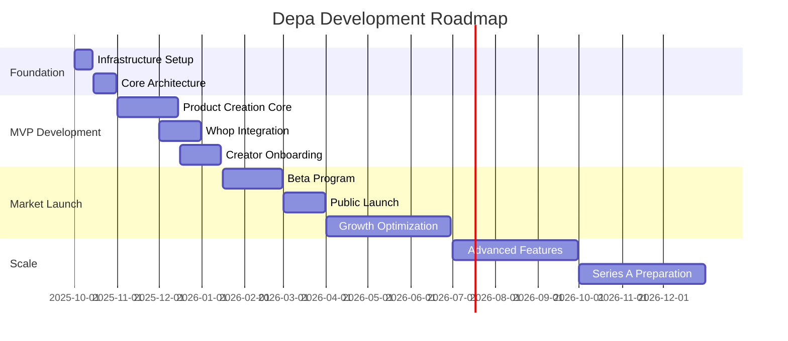

# Development Execution Guide - Digital Product Factory
## Depa - From Concept to Scale

**Version:** 1.0  
**Date:** 2025-09-28  
**Owner:** Felipe PM + Claude AI  
**Status:** COMPREHENSIVE DEVELOPMENT ROADMAP  

---

## Executive Summary

This document provides a granular, step-by-step development guide for building the Depa Digital Product Factory from initial development to market-leading scale. The roadmap is designed to maintain laser focus on the core value proposition: enabling creators to launch digital products in 1-3 days instead of 3-6 months.

**Total Timeline**: 18 months from start to Series A readiness  
**MVP Target**: 4 months to first paying creators  
**Market Validation**: 6 months to product-market fit  
**Scale Preparation**: 12 months to Series A positioning  

---

## Phase Structure Overview



---

## PHASE 1: FOUNDATION (Weeks 1-6) - October 1-November 15, 2025

### Week 1-2: Infrastructure & Development Environment Setup

#### Day 1-3: Core Infrastructure
**Objective**: Establish scalable, production-ready infrastructure foundation

**Tasks**:
1. **GCP Project Setup**
   - [ ] Create GCP project with billing account
   - [ ] Set up IAM roles and service accounts
   - [ ] Configure VPC and security groups
   - [ ] Establish monitoring and logging (Cloud Monitoring, Cloud Logging)
   - **Deliverable**: Production-ready GCP environment

2. **Database Infrastructure**
   - [ ] Set up Cloud SQL PostgreSQL (production + staging)
   - [ ] Configure Redis cluster for caching and sessions
   - [ ] Implement database backup and recovery procedures
   - [ ] Set up connection pooling and monitoring
   - **Deliverable**: Scalable database infrastructure

3. **CI/CD Pipeline Foundation**
   - [ ] Set up GitHub repository structure
   - [ ] Configure GitHub Actions for automated testing
   - [ ] Implement Docker containerization
   - [ ] Set up staging and production deployment pipelines
   - **Deliverable**: Automated deployment pipeline

#### Day 4-7: Development Environment
**Objective**: Create efficient development workflow for team productivity

**Tasks**:
1. **Local Development Setup**
   - [ ] Create development environment documentation
   - [ ] Set up Docker Compose for local development
   - [ ] Configure environment variables and secrets management
   - [ ] Implement hot reload and debugging capabilities
   - **Deliverable**: Streamlined developer experience

2. **Code Quality Framework**
   - [ ] Set up ESLint, Prettier, and TypeScript configurations
   - [ ] Configure pre-commit hooks for code quality
   - [ ] Implement automated testing framework (Jest, Pytest)
   - [ ] Set up code coverage reporting
   - **Deliverable**: Code quality automation

#### Day 8-14: Core Architecture Implementation
**Objective**: Build foundational system architecture supporting AI workflows

**Tasks**:
1. **Backend API Foundation**
   - [ ] Set up FastAPI project structure
   - [ ] Implement authentication and authorization (JWT + OAuth)
   - [ ] Create user management and creator profiles
   - [ ] Set up API versioning and documentation (OpenAPI)
   - **Deliverable**: Secure, documented API foundation

2. **Frontend Application Bootstrap**
   - [ ] Set up Next.js 14 project with TypeScript
   - [ ] Configure Tailwind CSS and component library
   - [ ] Implement authentication flow and protected routes
   - [ ] Create responsive layout and navigation structure
   - **Deliverable**: Modern, responsive frontend foundation

3. **AI Integration Framework**
   - [ ] Set up multi-provider AI client (OpenAI, Gemini, Anthropic)
   - [ ] Implement token usage tracking and cost optimization
   - [ ] Create AI prompt management system
   - [ ] Set up error handling and fallback mechanisms
   - **Deliverable**: Robust AI integration layer

### Week 3-4: Core Database Schema & Creator Management

#### Day 15-21: Database Schema Implementation
**Objective**: Create comprehensive data model supporting product creation workflows

**Critical Tables**:
1. **Creator Management**
   ```sql
   -- Core creator tables
   CREATE TABLE creators (
     id UUID PRIMARY KEY,
     email VARCHAR(255) UNIQUE NOT NULL,
     username VARCHAR(50) UNIQUE,
     full_name VARCHAR(255),
     avatar_url TEXT,
     expertise_area VARCHAR(100),
     creator_level creator_level_enum,
     subscription_tier subscription_tier_enum,
     created_at TIMESTAMP DEFAULT NOW(),
     updated_at TIMESTAMP DEFAULT NOW()
   );

   CREATE TABLE creator_profiles (
     creator_id UUID REFERENCES creators(id),
     bio TEXT,
     expertise_keywords TEXT[],
     social_links JSONB,
     brand_voice brand_voice_enum,
     primary_goals TEXT[],
     onboarding_completed BOOLEAN DEFAULT FALSE,
     onboarding_completed_at TIMESTAMP
   );
   ```

2. **Product Management**
   ```sql
   -- Product creation tables
   CREATE TABLE products (
     id UUID PRIMARY KEY,
     creator_id UUID REFERENCES creators(id),
     title VARCHAR(255) NOT NULL,
     description TEXT,
     product_type product_type_enum,
     status product_status_enum,
     target_audience TEXT,
     suggested_price DECIMAL(10,2),
     actual_price DECIMAL(10,2),
     content_outline JSONB,
     brand_assets JSONB,
     created_at TIMESTAMP DEFAULT NOW(),
     published_at TIMESTAMP,
     last_updated TIMESTAMP DEFAULT NOW()
   );

   CREATE TABLE product_content (
     id UUID PRIMARY KEY,
     product_id UUID REFERENCES products(id),
     section_type VARCHAR(50),
     section_order INTEGER,
     content_data JSONB,
     ai_generated BOOLEAN DEFAULT TRUE,
     human_edited BOOLEAN DEFAULT FALSE,
     version_number INTEGER DEFAULT 1,
     created_at TIMESTAMP DEFAULT NOW()
   );
   ```

3. **Marketplace Integration**
   ```sql
   -- Marketplace and sales tracking
   CREATE TABLE marketplace_integrations (
     id UUID PRIMARY KEY,
     creator_id UUID REFERENCES creators(id),
     marketplace_type marketplace_enum,
     external_user_id VARCHAR(255),
     access_token_encrypted TEXT,
     refresh_token_encrypted TEXT,
     integration_status integration_status_enum,
     connected_at TIMESTAMP DEFAULT NOW(),
     last_sync_at TIMESTAMP
   );

   CREATE TABLE product_publications (
     id UUID PRIMARY KEY,
     product_id UUID REFERENCES products(id),
     marketplace_integration_id UUID REFERENCES marketplace_integrations(id),
     external_product_id VARCHAR(255),
     marketplace_url TEXT,
     publication_status publication_status_enum,
     published_at TIMESTAMP,
     last_sync_at TIMESTAMP
   );
   ```

**Tasks**:
- [ ] Implement all core database tables with proper constraints
- [ ] Set up database migrations and version control
- [ ] Create database seeding scripts for development
- [ ] Implement database performance optimization (indexes, partitioning)
- **Deliverable**: Complete database schema supporting all MVP features

#### Day 22-28: Creator Management System
**Objective**: Build comprehensive creator account and profile management

**Tasks**:
1. **Authentication & Registration**
   - [ ] Implement secure user registration with email verification
   - [ ] Set up OAuth integration (Google, GitHub, LinkedIn)
   - [ ] Create password reset and account recovery flows
   - [ ] Implement account deletion and data export (GDPR compliance)
   - **Deliverable**: Secure creator authentication system

2. **Creator Profile Management**
   - [ ] Build creator profile creation and editing interfaces
   - [ ] Implement expertise area selection and validation
   - [ ] Create brand voice and style preference settings
   - [ ] Set up creator goal tracking and progress monitoring
   - **Deliverable**: Comprehensive creator profile system

### Week 5-6: AI Department Framework

#### Day 29-35: AI Agent Architecture
**Objective**: Create foundational AI agent system for product creation

**Tasks**:
1. **Agent Orchestration System**
   - [ ] Design and implement agent communication protocols
   - [ ] Create agent state management and coordination
   - [ ] Set up agent performance monitoring and logging
   - [ ] Implement agent fallback and error recovery mechanisms
   - **Deliverable**: Robust multi-agent orchestration framework

2. **Content Creation Agent (Core)**
   - [ ] Implement ebook content generation workflows
   - [ ] Create course structure and lesson planning agents
   - [ ] Build template creation and customization agents
   - [ ] Set up content quality assessment and optimization
   - **Deliverable**: Functional content creation AI department

#### Day 36-42: Product Creation Pipeline
**Objective**: Build end-to-end product creation workflow

**Tasks**:
1. **Product Ideation System**
   - [ ] Implement AI-powered product idea generation
   - [ ] Create market research and demand validation
   - [ ] Build competitive analysis and positioning tools
   - [ ] Set up pricing recommendation algorithms
   - **Deliverable**: Intelligent product ideation system

2. **Content Assembly Pipeline**
   - [ ] Create automated content structure generation
   - [ ] Implement AI-assisted content writing and editing
   - [ ] Build visual asset integration and optimization
   - [ ] Set up final product compilation and formatting
   - **Deliverable**: Automated product assembly pipeline

---

## PHASE 2: MVP CORE DEVELOPMENT (Weeks 7-16) - November 16, 2025 - January 15, 2026

### Week 7-8: Creator Onboarding Experience

#### Day 43-49: Onboarding Wizard Implementation
**Objective**: Create seamless creator onboarding leading to first product creation

**Tasks**:
1. **Onboarding Flow Development**
   - [ ] Build 4-step creator profiling wizard
   - [ ] Implement AI-powered product idea generation
   - [ ] Create real-time preview and customization interface
   - [ ] Set up onboarding progress tracking and analytics
   - **Deliverable**: Complete creator onboarding experience

2. **First Product Creation**
   - [ ] Implement guided first product creation workflow
   - [ ] Create template selection and customization interface
   - [ ] Build real-time AI content generation with progress indicators
   - [ ] Set up product preview and editing capabilities
   - **Deliverable**: Guided first product creation experience

#### Day 50-56: Creator Dashboard
**Objective**: Build comprehensive creator workspace and product management

**Tasks**:
1. **Dashboard Core Features**
   - [ ] Create product portfolio overview and management
   - [ ] Implement revenue tracking and analytics visualization
   - [ ] Build product performance metrics and insights
   - [ ] Set up creator task management and recommendations
   - **Deliverable**: Functional creator dashboard

2. **Product Management Interface**
   - [ ] Build product editing and version control system
   - [ ] Implement draft saving and collaboration features
   - [ ] Create product status tracking and workflow management
   - [ ] Set up bulk operations and batch processing
   - **Deliverable**: Advanced product management tools

### Week 9-12: Whop Marketplace Integration

#### Day 57-70: Whop API Integration
**Objective**: Complete integration with Whop marketplace for product publishing

**Tasks**:
1. **Authentication & Connection**
   - [ ] Implement Whop OAuth flow and token management
   - [ ] Create marketplace account linking and verification
   - [ ] Set up secure token storage and refresh mechanisms
   - [ ] Build connection status monitoring and alerts
   - **Deliverable**: Secure Whop marketplace connection

2. **Product Publishing Pipeline**
   - [ ] Implement automated product listing creation
   - [ ] Build file upload and asset management for Whop
   - [ ] Create SEO optimization for marketplace listings
   - [ ] Set up pricing and metadata synchronization
   - **Deliverable**: Automated Whop publishing pipeline

#### Day 71-84: Marketplace Optimization
**Objective**: Optimize product performance and discoverability on Whop

**Tasks**:
1. **Listing Optimization**
   - [ ] Implement automated SEO keyword integration
   - [ ] Create compelling product description generation
   - [ ] Build cover image optimization and A/B testing
   - [ ] Set up conversion tracking and performance monitoring
   - **Deliverable**: Marketplace listing optimization system

2. **Sales Analytics Integration**
   - [ ] Implement real-time sales data synchronization
   - [ ] Create revenue tracking and reporting dashboard
   - [ ] Build customer insights and feedback collection
   - [ ] Set up automated performance optimization recommendations
   - **Deliverable**: Comprehensive sales analytics system

### Week 13-16: Advanced Product Creation Features

#### Day 85-98: Enhanced Content Generation
**Objective**: Expand AI capabilities for different product types and quality levels

**Tasks**:
1. **Multi-Format Product Support**
   - [ ] Implement advanced ebook creation with chapters and formatting
   - [ ] Build comprehensive course creation with modules and assessments
   - [ ] Create template pack generation with multiple file formats
   - [ ] Set up community content and engagement material creation
   - **Deliverable**: Multi-format product creation capabilities

2. **Content Quality Enhancement**
   - [ ] Implement AI content editing and improvement suggestions
   - [ ] Create plagiarism detection and originality verification
   - [ ] Build brand consistency checking and style enforcement
   - [ ] Set up content performance prediction and optimization
   - **Deliverable**: Professional-grade content quality system

#### Day 99-112: Marketing & Launch Department
**Objective**: Build automated marketing and product launch capabilities

**Tasks**:
1. **Landing Page Generation**
   - [ ] Implement high-converting sales page creation
   - [ ] Create A/B testing framework for page optimization
   - [ ] Build mobile-responsive design and preview system
   - [ ] Set up conversion tracking and analytics integration
   - **Deliverable**: Automated landing page generation system

2. **Launch Campaign Automation**
   - [ ] Create multi-channel launch campaign coordination
   - [ ] Implement email sequence generation and automation
   - [ ] Build social media content creation and scheduling
   - [ ] Set up influencer outreach and partnership templates
   - **Deliverable**: Comprehensive launch campaign automation

---

## PHASE 3: MVP COMPLETION & BETA LAUNCH (Weeks 17-20) - January 16 - February 28, 2026

### Week 17-18: MVP Integration & Testing

#### Day 113-119: End-to-End Integration
**Objective**: Ensure seamless integration of all MVP components

**Tasks**:
1. **System Integration Testing**
   - [ ] Test complete creator journey from signup to product sale
   - [ ] Validate all AI department interactions and handoffs
   - [ ] Verify Whop integration reliability and error handling
   - [ ] Confirm payment processing and revenue tracking accuracy
   - **Deliverable**: Fully integrated MVP system

2. **Performance Optimization**
   - [ ] Optimize API response times and database queries
   - [ ] Implement caching strategies for AI-generated content
   - [ ] Set up CDN for asset delivery and global performance
   - [ ] Conduct load testing and scalability validation
   - **Deliverable**: Performance-optimized production system

#### Day 120-126: Quality Assurance & Bug Fixes
**Objective**: Ensure production-ready quality and reliability

**Tasks**:
1. **Comprehensive Testing**
   - [ ] Execute full regression testing suite
   - [ ] Perform security testing and vulnerability assessment
   - [ ] Validate cross-browser and mobile compatibility
   - [ ] Test edge cases and error handling scenarios
   - **Deliverable**: Production-ready quality assurance

2. **Documentation & Support**
   - [ ] Complete user documentation and help guides
   - [ ] Create creator onboarding tutorials and videos
   - [ ] Set up customer support system and knowledge base
   - [ ] Implement in-app help and guidance features
   - **Deliverable**: Comprehensive user support system

### Week 19-20: Beta Program Launch

#### Day 127-133: Beta Preparation
**Objective**: Prepare for controlled beta launch with selected creators

**Tasks**:
1. **Beta Program Setup**
   - [ ] Define beta criteria and select initial creator cohort (50 creators)
   - [ ] Create beta onboarding process and communication plan
   - [ ] Set up feedback collection and iteration workflows
   - [ ] Implement beta-specific analytics and monitoring
   - **Deliverable**: Ready-to-launch beta program

2. **Monitoring & Support Infrastructure**
   - [ ] Set up real-time system monitoring and alerting
   - [ ] Create customer support ticketing and response system
   - [ ] Implement user behavior analytics and conversion tracking
   - [ ] Set up automated backup and disaster recovery procedures
   - **Deliverable**: Production monitoring and support infrastructure

#### Day 134-140: Beta Launch Execution
**Objective**: Launch beta program and begin real-world validation

**Tasks**:
1. **Beta Launch**
   - [ ] Execute beta creator onboarding and training
   - [ ] Monitor system performance and user experience
   - [ ] Collect feedback and identify improvement priorities
   - [ ] Track key metrics: activation rate, time to first product, creator satisfaction
   - **Deliverable**: Active beta program with engaged creators

2. **Iteration Planning**
   - [ ] Analyze beta feedback and usage data
   - [ ] Prioritize feature improvements and bug fixes
   - [ ] Plan public launch strategy and timeline
   - [ ] Prepare marketing and PR materials for public launch
   - **Deliverable**: Data-driven public launch strategy

---

## PHASE 4: PUBLIC LAUNCH & MARKET VALIDATION (Weeks 21-26) - March 1 - June 30, 2026

### Week 21-22: Public Launch Preparation

#### Day 141-147: Launch Infrastructure Scaling
**Objective**: Prepare infrastructure for public launch traffic and usage

**Tasks**:
1. **Scalability Preparation**
   - [ ] Scale database and server infrastructure for 10x traffic
   - [ ] Implement auto-scaling and load balancing
   - [ ] Set up global CDN and edge caching
   - [ ] Prepare customer support for increased volume
   - **Deliverable**: Scalable production infrastructure

2. **Marketing & PR Campaign**
   - [ ] Launch product hunt campaign and creator community outreach
   - [ ] Execute content marketing and thought leadership strategy
   - [ ] Implement referral program and viral growth mechanisms
   - [ ] Set up conversion tracking and attribution modeling
   - **Deliverable**: Multi-channel marketing campaign

#### Day 148-154: Public Launch
**Objective**: Execute successful public launch with strong initial traction

**Tasks**:
1. **Launch Execution**
   - [ ] Execute coordinated launch across all marketing channels
   - [ ] Monitor system performance and user onboarding
   - [ ] Provide responsive customer support and issue resolution
   - [ ] Track key launch metrics and conversion funnels
   - **Deliverable**: Successful public launch with initial user traction

2. **Initial Optimization**
   - [ ] Analyze launch performance and user feedback
   - [ ] Implement rapid improvements and bug fixes
   - [ ] Optimize conversion rates and user experience
   - [ ] Plan post-launch feature development priorities
   - **Deliverable**: Optimized platform based on real user data

### Week 23-26: Growth Optimization & Product-Market Fit

#### Day 155-182: Growth Experimentation
**Objective**: Achieve product-market fit through rapid experimentation and optimization

**Monthly Focus Areas**:

**Month 1 (March): Creator Acquisition & Activation**
- **Week 23**: Creator acquisition channel optimization
  - [ ] A/B test onboarding flows and conversion optimization
  - [ ] Implement viral referral program and creator incentives
  - [ ] Optimize SEO and content marketing for creator acquisition
  - **Target**: 500+ creators, 70% activation rate

- **Week 24**: First product creation optimization
  - [ ] Reduce time to first product creation to <24 hours
  - [ ] Improve AI content quality and creator satisfaction
  - [ ] Implement advanced product templates and customization
  - **Target**: 80% of creators complete first product in 72 hours

**Month 2 (April): Revenue Generation & Creator Success**
- **Week 25**: Marketplace performance optimization
  - [ ] Improve product listing quality and conversion rates
  - [ ] Implement advanced SEO and discoverability features
  - [ ] Create creator success coaching and optimization tools
  - **Target**: 25% of products generate $100+ in first 30 days

- **Week 26**: Creator retention and expansion
  - [ ] Build creator community and networking features
  - [ ] Implement advanced analytics and business intelligence
  - [ ] Create multi-product creation workflows and batch processing
  - **Target**: 60% of creators create second product within 60 days

**Key Metrics Tracking**:
- **Creator Acquisition**: 1,000+ active creators by end of Phase 4
- **Product Creation**: 5,000+ products created and published
- **Revenue Generation**: $50K+ creator revenue generated through platform
- **Product-Market Fit**: NPS >50, retention >60%, viral coefficient >0.5

---

## PHASE 5: SCALE PREPARATION (Weeks 27-39) - July 1 - September 30, 2026

### Week 27-30: Advanced Feature Development

#### Month 1 (July): Design Department & Visual Creation
**Objective**: Add comprehensive design capabilities to product creation workflow

**Week 27-28: Design Agent Development**
- [ ] Implement AI-powered cover design generation
- [ ] Create visual asset library and customization tools
- [ ] Build brand consistency checking and style guides
- [ ] Set up multi-format visual export and optimization
- **Deliverable**: Professional design capabilities for all product types

**Week 29-30: Visual Workflow Integration**
- [ ] Integrate design tools into product creation pipeline
- [ ] Create visual preview and editing interfaces
- [ ] Implement batch visual processing and optimization
- [ ] Set up design performance analytics and A/B testing
- **Deliverable**: Seamless visual creation workflow

#### Month 2 (August): Analytics & Optimization Department
**Objective**: Provide creators with advanced analytics and business intelligence

**Week 31-32: Creator Analytics Platform**
- [ ] Build comprehensive creator performance dashboard
- [ ] Implement predictive analytics and success forecasting
- [ ] Create competitive analysis and market insights
- [ ] Set up automated optimization recommendations
- **Deliverable**: Advanced creator analytics and intelligence system

**Week 33-34: Product Performance Optimization**
- [ ] Implement A/B testing framework for creator products
- [ ] Create conversion optimization and revenue maximization tools
- [ ] Build audience insights and customer behavior analysis
- [ ] Set up automated pricing optimization and recommendations
- **Deliverable**: Product performance optimization suite

#### Month 3 (September): Creator Success & Community
**Objective**: Build creator community and advanced success features

**Week 35-36: Creator Community Platform**
- [ ] Implement creator networking and collaboration features
- [ ] Create mastermind groups and peer learning systems
- [ ] Build creator showcase and success story platform
- [ ] Set up mentor matching and expert coaching programs
- **Deliverable**: Thriving creator community ecosystem

**Week 37-39: Advanced Creator Tools**
- [ ] Implement white-label solutions for agencies
- [ ] Create custom branding and template creation tools
- [ ] Build advanced workflow automation and batch processing
- [ ] Set up creator certification and skill development programs
- **Deliverable**: Professional-grade creator tools and services

### Key Scale Metrics (End of Phase 5):
- **Creator Base**: 5,000+ active creators
- **Product Volume**: 25,000+ products created
- **Revenue Scale**: $500K+ monthly creator revenue
- **Market Position**: Top 3 digital product creation platform globally

---

## PHASE 6: SERIES A PREPARATION (Weeks 40-52) - October 1 - December 31, 2026

### Week 40-43: Enterprise & Marketplace Expansion

#### Month 1 (October): Multi-Marketplace Strategy
**Objective**: Expand beyond Whop to multiple marketplace integrations

**Week 40-41: Marketplace Integration Expansion**
- [ ] Integrate with Gumroad, Teachable, and Udemy
- [ ] Create universal product publishing and synchronization
- [ ] Implement cross-marketplace analytics and optimization
- [ ] Set up marketplace-specific SEO and optimization tools
- **Deliverable**: Multi-marketplace publishing platform

**Week 42-43: Global Market Expansion**
- [ ] Implement multi-language support and localization
- [ ] Create region-specific templates and market insights
- [ ] Set up global payment processing and tax compliance
- [ ] Build international creator acquisition and support
- **Deliverable**: Globally scalable platform architecture

### Week 44-47: Enterprise Solutions & B2B

#### Month 2 (November): Enterprise Creator Solutions
**Objective**: Develop enterprise and agency solutions for scale

**Week 44-45: Agency & Team Features**
- [ ] Implement team collaboration and workspace management
- [ ] Create client management and white-label solutions
- [ ] Build advanced permissions and workflow management
- [ ] Set up enterprise billing and contract management
- **Deliverable**: Comprehensive enterprise creator platform

**Week 46-47: API & Developer Ecosystem**
- [ ] Launch public API for third-party integrations
- [ ] Create developer documentation and SDK
- [ ] Build app marketplace for creator tools and extensions
- [ ] Set up partner program and revenue sharing
- **Deliverable**: Open ecosystem and developer platform

### Week 48-52: Series A Positioning

#### Month 3 (December): Investment Preparation
**Objective**: Prepare comprehensive Series A fundraising materials and metrics

**Week 48-49: Metrics & Performance Documentation**
- [ ] Compile comprehensive growth metrics and unit economics
- [ ] Create detailed financial projections and market analysis
- [ ] Document technology differentiation and competitive advantages
- [ ] Prepare customer case studies and success stories
- **Deliverable**: Investment-ready performance documentation

**Week 50-52: Fundraising Execution**
- [ ] Create pitch deck and executive summary
- [ ] Schedule investor meetings and due diligence preparation
- [ ] Execute Series A fundraising process
- [ ] Plan post-funding growth and expansion strategy
- **Deliverable**: Series A funding secured for scale phase

### Series A Targets:
- **ARR**: $5M+ with 40%+ growth rate
- **Creator Base**: 15,000+ active creators
- **Product Volume**: 100,000+ products created
- **Market Position**: #1 digital product creation platform
- **Team Size**: 25+ employees across engineering, product, and growth
- **Valuation Target**: $50M+ Series A round

---

## POST-SERIES A SCALE STRATEGY (2027+)

### Year 2 Growth Strategy

#### Q1 2027: International Expansion
- **Geographic Expansion**: EU, Asia-Pacific markets
- **Product Localization**: 10+ languages, regional templates
- **Local Partnerships**: Regional marketplace and creator partnerships
- **Regulatory Compliance**: GDPR, regional data protection laws

#### Q2 2027: Advanced AI & Automation
- **AI Enhancement**: Custom model training and creator-specific optimization
- **Automation Expansion**: Video creation, podcast generation, interactive content
- **Personalization**: Advanced creator success prediction and guidance
- **Integration Ecosystem**: 50+ marketplace and tool integrations

#### Q3 2027: Creator Economy Leadership
- **Creator Marketplace**: Creator-to-creator template and tool marketplace
- **Educational Platform**: Creator university and certification programs
- **Creator Services**: Done-for-you services and expert marketplace
- **Creator Capital**: Creator funding and revenue-based financing

#### Q4 2027: Platform Ecosystem
- **Open Platform**: Full API ecosystem and third-party development
- **Enterprise Solutions**: Large organization and corporate training
- **Acquisition Strategy**: Complementary tool and platform acquisitions
- **IPO Preparation**: Public company readiness and preparation

### Long-term Vision (2028-2030)
- **Market Position**: Dominant global digital product creation platform
- **Creator Base**: 100,000+ active creators generating $1B+ annually
- **Geographic Reach**: 50+ countries with localized experiences
- **Product Ecosystem**: Complete creator economy infrastructure
- **Valuation Target**: $1B+ IPO or strategic acquisition opportunity

---

## Critical Success Factors & Risk Mitigation

### Technical Risks & Mitigation

#### AI Model Dependency Risk
- **Risk**: Dependence on third-party AI providers (OpenAI, Anthropic)
- **Mitigation**: 
  - Multi-provider architecture with intelligent fallbacks
  - Investment in proprietary model development
  - Local model deployment for critical functions
  - Content caching and optimization

#### Scalability Risk
- **Risk**: Platform unable to handle rapid user growth
- **Mitigation**:
  - Cloud-native architecture with auto-scaling
  - Microservices design for independent scaling
  - Comprehensive load testing and monitoring
  - Performance optimization and caching strategies

#### Security & Privacy Risk
- **Risk**: Creator data breach or IP theft
- **Mitigation**:
  - End-to-end encryption for all creator content
  - SOC 2 Type II compliance and regular audits
  - Advanced access controls and monitoring
  - Creator content ownership and protection guarantees

### Business Risks & Mitigation

#### Market Competition Risk
- **Risk**: Large tech companies (Google, Microsoft, Adobe) enter market
- **Mitigation**:
  - Speed-to-market advantage and creator network effects
  - Deep specialization in creator workflows
  - Strong creator community and switching costs
  - Continuous innovation and feature development

#### Creator Adoption Risk
- **Risk**: Creators don't adopt AI-generated content creation
- **Mitigation**:
  - Extensive creator education and success showcases
  - Gradual AI introduction with human oversight
  - Quality guarantees and editing capabilities
  - Success-based pricing and risk reduction

#### Marketplace Integration Risk
- **Risk**: Marketplace partners change policies or pricing
- **Mitigation**:
  - Multi-marketplace strategy reducing single-point dependency
  - Direct creator audience building
  - Proprietary marketplace development
  - Strong partner relationships and contracts

### Success Monitoring Framework

#### Weekly KPIs
- **Creator Acquisition**: New creator signups and activation rates
- **Product Creation**: Products created, published, and generating revenue
- **Platform Performance**: System uptime, response times, error rates
- **Creator Success**: Revenue generated, creator satisfaction scores

#### Monthly OKRs
- **Growth**: Creator base expansion and retention rates
- **Product**: Feature adoption and usage metrics
- **Revenue**: Platform revenue and creator revenue growth
- **Market Position**: Competitive analysis and market share

#### Quarterly Strategic Reviews
- **Product-Market Fit**: Creator feedback, usage patterns, success rates
- **Competitive Position**: Market analysis, differentiation, threats
- **Technology Evolution**: AI advancement, platform scalability, innovation
- **Financial Performance**: Unit economics, growth efficiency, funding needs

---

## Resource Requirements & Team Building

### Phase 1-2 Team (MVP Development): 6-8 people
- **1x Founding Engineer/CTO**: Full-stack architecture and technical leadership
- **2x Full-Stack Engineers**: Frontend (Next.js) and Backend (FastAPI) development
- **1x AI/ML Engineer**: AI integration, prompt engineering, model optimization
- **1x Product Designer**: UX/UI design, creator experience optimization
- **1x DevOps Engineer**: Infrastructure, CI/CD, monitoring, security
- **1x Product Manager**: Feature prioritization, creator research, roadmap management
- **1x Founding Creator Success**: Creator onboarding, feedback, community building

### Phase 3-4 Team (Launch & Growth): 12-15 people
- **Engineering (6)**: Add mobile developer, data engineer, QA engineer
- **Product & Design (3)**: Add UX researcher, content designer
- **Growth & Marketing (3)**: Add growth marketer, content marketer, creator evangelist
- **Operations (3)**: Add customer success, business operations, legal/compliance

### Phase 5-6 Team (Scale): 20-25 people
- **Engineering (10)**: Add security engineer, platform engineers, infrastructure team
- **Product & Design (5)**: Add product managers for each department, design system lead
- **Growth & Marketing (5)**: Add performance marketing, partnerships, PR/communications
- **Operations (5)**: Add finance, HR, legal, international expansion lead

### Technology Stack Evolution

#### MVP Stack (Phase 1-2)
- **Frontend**: Next.js 14, TypeScript, Tailwind CSS, Zustand
- **Backend**: FastAPI, PostgreSQL, Redis, Celery
- **AI**: OpenAI GPT-4, Anthropic Claude, custom prompt management
- **Infrastructure**: GCP (Cloud Run, Cloud SQL, Cloud Storage)
- **Monitoring**: DataDog, Sentry, Google Analytics

#### Growth Stack (Phase 3-4)
- **Add**: React Native mobile app, GraphQL API layer
- **Enhance**: Kubernetes orchestration, advanced caching (Varnish)
- **Analytics**: Mixpanel, Amplitude, custom data warehouse
- **AI**: Fine-tuned models, vector databases (Pinecone)

#### Scale Stack (Phase 5-6)
- **Microservices**: Event-driven architecture, service mesh
- **Data**: Apache Kafka, ClickHouse, ML pipelines
- **Global**: Multi-region deployment, edge computing
- **Enterprise**: SSO, advanced security, compliance tooling

---

## Budget & Financial Planning

### Phase 1-2 Budget (6 months): $750K
- **Personnel (70%)**: $525K - Engineering and core team salaries
- **Infrastructure (15%)**: $112K - GCP, tools, AI API costs
- **Legal & Compliance (10%)**: $75K - Incorporation, IP, compliance setup
- **Marketing & Research (5%)**: $38K - Creator research, beta program

### Phase 3-4 Budget (6 months): $1.2M
- **Personnel (75%)**: $900K - Expanded team for launch and growth
- **Infrastructure (10%)**: $120K - Scaled infrastructure, monitoring
- **Marketing & Growth (10%)**: $120K - Launch campaigns, creator acquisition
- **Operations (5%)**: $60K - Legal, accounting, business operations

### Phase 5-6 Budget (6 months): $2.5M
- **Personnel (70%)**: $1.75M - Full team for scale preparation
- **Infrastructure (10%)**: $250K - Global infrastructure, enterprise features
- **Marketing & Growth (15%)**: $375K - Aggressive growth and expansion
- **Operations & Legal (5%)**: $125K - Series A preparation, compliance

### Total 18-Month Budget: $4.45M
- **Seed Funding Target**: $1.5M (covers first 9 months + contingency)
- **Series A Target**: $15M (accelerated growth and international expansion)

---

## Quality Assurance & Testing Strategy

### Automated Testing Framework
- **Unit Tests**: 90%+ code coverage for all business logic
- **Integration Tests**: API endpoints, database operations, AI workflows
- **End-to-End Tests**: Complete creator journeys, product creation flows
- **Performance Tests**: Load testing, stress testing, scalability validation

### Creator Testing Program
- **Alpha Testing**: Internal team and advisors (ongoing)
- **Beta Testing**: 50 selected creators (4 weeks)
- **Early Access**: 200 creators with feedback program
- **Public Testing**: Gradual rollout with usage monitoring

### Security & Compliance Testing
- **Security Audits**: Quarterly penetration testing and vulnerability assessment
- **Compliance Validation**: SOC 2, GDPR, CCPA compliance verification
- **Data Protection**: Creator content security and IP protection validation
- **Incident Response**: Security incident response plan and testing

---

This comprehensive development guide provides a detailed roadmap for building Depa from initial concept to Series A-ready scale. The phased approach ensures focus on core value delivery while building toward long-term market leadership in the creator economy.

**Key Success Principle**: Maintain relentless focus on creator success - every feature, optimization, and strategic decision should be evaluated based on its impact on helping creators launch profitable digital products faster and more effectively.