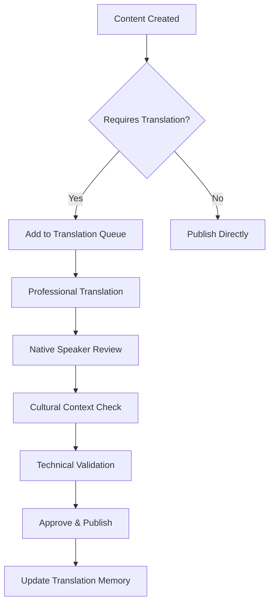

# Internationalization & Localization Guide
## AI Departments Platform

**Version:** 1.0  
**Date:** 2025-09-13  
**Owner:** Felipe PM + Claude  
**Primary Market:** Brazil (Portuguese)  
**Status:** APPROVED  

---

## Localization Strategy Overview

### Phase 1: Brazil-First Approach
- **Primary Language**: Portuguese (Brazil) - pt-BR
- **Secondary Language**: English (US) - en-US (admin/technical interfaces)
- **Market Focus**: Brazilian micro-entrepreneurs
- **Cultural Adaptation**: Brazilian business culture, payment methods, communication styles

### Phase 2: LATAM Expansion
- **Target Markets**: Mexico (es-MX), Colombia (es-CO), Argentina (es-AR)
- **Timeline**: Q3-Q4 2025
- **Strategy**: Leverage Brazilian success for Spanish-speaking markets

---

## Language Support Architecture

### Technical Implementation
```typescript
// Language configuration structure
interface LocaleConfig {
  code: string;           // 'pt-BR', 'en-US', 'es-MX'
  name: string;           // 'Português (Brasil)'
  rtl: boolean;           // false for all current targets
  currency: Currency;     // BRL, USD, MXN, etc.
  dateFormat: string;     // DD/MM/YYYY for BR, MM/DD/YYYY for US
  numberFormat: {
    decimal: string;      // ',' for BR, '.' for US
    thousands: string;    // '.' for BR, ',' for US
  };
  timezone: string;       // 'America/Sao_Paulo', 'America/Mexico_City'
}

// Supported locales
const SUPPORTED_LOCALES: LocaleConfig[] = [
  {
    code: 'pt-BR',
    name: 'Português (Brasil)',
    rtl: false,
    currency: 'BRL',
    dateFormat: 'DD/MM/YYYY',
    numberFormat: { decimal: ',', thousands: '.' },
    timezone: 'America/Sao_Paulo'
  },
  {
    code: 'en-US',
    name: 'English (United States)',
    rtl: false,
    currency: 'USD',
    dateFormat: 'MM/DD/YYYY',
    numberFormat: { decimal: '.', thousands: ',' },
    timezone: 'America/New_York'
  }
];
```

### Message Key Structure
```json
{
  "auth": {
    "login": {
      "title": "Entre na sua conta",
      "email_placeholder": "Digite seu email",
      "password_placeholder": "Digite sua senha",
      "submit_button": "Entrar",
      "forgot_password": "Esqueceu a senha?",
      "create_account": "Criar conta"
    }
  },
  "departments": {
    "marketing": {
      "title": "Departamento de Marketing",
      "description": "Geração e agendamento de conteúdo automático",
      "agents": {
        "social_media": "Redes Sociais",
        "email_marketing": "Email Marketing",
        "content_calendar": "Calendário de Conteúdo"
      }
    },
    "customer_service": {
      "title": "Departamento de Atendimento",
      "description": "Respostas automáticas 24/7 no WhatsApp",
      "agents": {
        "whatsapp_responder": "Respondedor WhatsApp",
        "faq_builder": "Base de Conhecimento",
        "escalation_manager": "Gerente de Escalação"
      }
    }
  },
  "common": {
    "actions": {
      "save": "Salvar",
      "cancel": "Cancelar",
      "delete": "Excluir",
      "edit": "Editar",
      "create": "Criar",
      "update": "Atualizar"
    },
    "status": {
      "active": "Ativo",
      "inactive": "Inativo",
      "pending": "Pendente",
      "completed": "Concluído",
      "failed": "Falhado"
    }
  }
}
```

---

## Content Localization Guidelines

### 1. Brazilian Portuguese Specificities

#### Regional Variations
```yaml
# Brazilian vs. European Portuguese differences
brazilian_portuguese:
  business_terms:
    - "empresa" (not "companhia")
    - "aplicativo" (not "aplicação") 
    - "celular" (not "telemóvel")
    - "atendimento" (not "atendimento ao cliente")
    
  informal_pronouns:
    - "você" (preferred over "tu")
    - "seu/sua" (possessive)
    
  currency_format:
    - "R$ 199,90" (space after R$, comma for decimals)
    - "R$ 1.999,90" (dot for thousands)
    
  date_format:
    - "13/09/2025" (DD/MM/YYYY)
    - "13 de setembro de 2025" (long format)
    
  phone_format:
    - "(11) 99999-9999" (with area code)
    - "+55 11 99999-9999" (international)
```

#### Cultural Adaptations
```yaml
# Brazilian business culture considerations
cultural_elements:
  greetings:
    - "Oi!" / "Olá!" (warm, personal)
    - "Bom dia!" / "Boa tarde!" (time-specific)
    - Avoid overly formal language
    
  business_hours:
    - "Segunda a sexta: 9h às 18h"
    - "Funcionamos de segunda a sábado"
    
  payment_methods:
    - PIX (most popular)
    - "Cartão de crédito/débito"
    - Boleto bancário
    - "Parcelado em até 12x"
    
  social_context:
    - Family-business balance emphasis
    - Community/relationship focus
    - Optimistic, solution-oriented language
```

### 2. AI-Generated Content Localization

#### Model Training Considerations
```python
# Portuguese content generation guidelines
class BrazilianContentGenerator:
    def __init__(self):
        self.cultural_context = {
            'tone': 'warm_professional',
            'formality': 'mixed',  # Formal for business, informal for social
            'regional_terms': 'brazilian_portuguese',
            'business_culture': 'relationship_first'
        }
    
    async def generate_social_post(
        self, 
        prompt: str, 
        business_type: str
    ) -> str:
        # Add Brazilian context to prompts
        brazilian_prompt = f"""
        Você é um especialista em marketing digital brasileiro.
        Crie um post para redes sociais que seja:
        - Caloroso e acolhedor (típico brasileiro)
        - Otimizado para o público brasileiro
        - Use linguagem natural do dia a dia
        - Inclua elementos culturais quando relevante
        
        Tipo de negócio: {business_type}
        Solicitação: {prompt}
        
        O post deve soar natural e autêntico para brasileiros.
        """
        
        return await self.ai_model.generate(brazilian_prompt)
```

#### Content Review Guidelines
```yaml
# Quality assurance for Portuguese content
content_review:
  grammar_check:
    - Correct verb conjugations
    - Proper use of crase (à, às)
    - Gender agreement (adjectives)
    - Regional vocabulary consistency
    
  cultural_appropriateness:
    - Business context suitable for SMBs
    - Respectful tone for customer service
    - Appropriate level of informality
    - Local references when beneficial
    
  brand_voice_consistency:
    - Matches established tone guide
    - Consistent terminology usage
    - Appropriate emoji usage for Brazilian audience
    - Professional but approachable
```

---

## User Interface Localization

### 1. Text Expansion & Contraction

#### Language Length Variations
```typescript
// Text length considerations
interface TextLengthGuidelines {
  portuguese_vs_english: {
    average_expansion: '15-30%';  // PT often longer than EN
    ui_impact: 'buttons_labels_navigation';
    solution: 'flexible_layouts';
  };
  
  common_expansions: {
    'Save': 'Salvar';           // +2 chars
    'Delete': 'Excluir';        // +3 chars  
    'Settings': 'Configurações'; // +8 chars
    'Dashboard': 'Painel de Controle'; // +11 chars
  };
}

// Responsive text handling
const TextComponent: React.FC = ({ i18nKey, maxLength }) => {
  const text = useTranslation(i18nKey);
  
  return (
    <div className="truncate" title={text}>
      {maxLength && text.length > maxLength 
        ? `${text.substring(0, maxLength)}...`
        : text
      }
    </div>
  );
};
```

#### UI Layout Adaptations
```css
/* Responsive layouts for text expansion */
.button-text {
  min-width: 120px; /* Account for Portuguese expansion */
  white-space: nowrap;
  overflow: hidden;
  text-overflow: ellipsis;
}

.navigation-item {
  flex: 1 1 auto; /* Allow flexible sizing */
  min-width: 0; /* Enable text truncation */
}

/* Brazilian-specific adjustments */
[lang="pt-BR"] .form-label {
  font-size: 0.9em; /* Slightly smaller for longer labels */
  line-height: 1.4;
}

[lang="pt-BR"] .button {
  padding: 0.75rem 1.5rem; /* More horizontal padding */
}
```

### 2. Date, Time, and Number Formatting

#### Localized Formatters
```typescript
// Brazilian formatting utilities
class BrazilianFormatter {
  static formatCurrency(amount: number): string {
    return new Intl.NumberFormat('pt-BR', {
      style: 'currency',
      currency: 'BRL'
    }).format(amount);
    // Output: "R$ 1.234,56"
  }
  
  static formatDate(date: Date, style: 'short' | 'long' = 'short'): string {
    const options: Intl.DateTimeFormatOptions = style === 'long' 
      ? { 
          day: 'numeric', 
          month: 'long', 
          year: 'numeric',
          weekday: 'long'
        }
      : { 
          day: '2-digit', 
          month: '2-digit', 
          year: 'numeric' 
        };
    
    return new Intl.DateTimeFormat('pt-BR', options).format(date);
    // Short: "13/09/2025"
    // Long: "segunda-feira, 13 de setembro de 2025"
  }
  
  static formatNumber(number: number): string {
    return new Intl.NumberFormat('pt-BR').format(number);
    // Output: "1.234.567,89"
  }
  
  static formatPhone(phone: string): string {
    // Brazilian mobile: (11) 99999-9999
    const cleaned = phone.replace(/\D/g, '');
    if (cleaned.length === 11) {
      return `(${cleaned.slice(0, 2)}) ${cleaned.slice(2, 7)}-${cleaned.slice(7)}`;
    }
    return phone;
  }
}
```

#### Time Zone Management
```typescript
// Brazilian time zone handling
class BrazilianTimeManager {
  private static readonly BRAZIL_TIMEZONE = 'America/Sao_Paulo';
  
  static toBrazilianTime(utcDate: Date): Date {
    return new Date(utcDate.toLocaleString('en-US', {
      timeZone: this.BRAZIL_TIMEZONE
    }));
  }
  
  static formatBusinessHours(
    start: string, 
    end: string
  ): string {
    // Convert 09:00-18:00 to "9h às 18h"
    const startHour = parseInt(start.split(':')[0]);
    const endHour = parseInt(end.split(':')[0]);
    return `${startHour}h às ${endHour}h`;
  }
  
  static getWorkingDays(): string {
    return 'Segunda a sexta-feira';
  }
}
```

---

## Content Management System

### 1. Translation Workflow

#### Content Categories
```yaml
translation_priorities:
  tier_1_critical:
    - User interface elements
    - Error messages
    - Onboarding flow
    - Payment/billing
    - Core department functionality
    
  tier_2_important:
    - Help documentation
    - Feature descriptions
    - Marketing content
    - Email templates
    
  tier_3_nice_to_have:
    - Advanced features
    - Admin interfaces
    - Developer documentation
```

#### Translation Process


### 2. Dynamic Content Localization

#### AI-Generated Content Translation
```python
class ContentLocalizationService:
    def __init__(self):
        self.translation_memory = TranslationMemory()
        self.ai_translator = AITranslator()
        self.human_reviewer = HumanReviewService()
    
    async def localize_ai_content(
        self, 
        content: str, 
        source_lang: str, 
        target_lang: str,
        context: ContentContext
    ) -> LocalizedContent:
        
        # Check translation memory first
        cached_translation = await self.translation_memory.find_match(
            content, source_lang, target_lang
        )
        
        if cached_translation and cached_translation.confidence > 0.9:
            return cached_translation
        
        # AI translation with context
        ai_translation = await self.ai_translator.translate(
            content=content,
            source_lang=source_lang,
            target_lang=target_lang,
            context={
                'business_type': context.business_type,
                'tone': context.brand_tone,
                'audience': context.target_audience,
                'cultural_context': 'brazilian_entrepreneur'
            }
        )
        
        # Human review for critical content
        if context.requires_human_review:
            ai_translation = await self.human_reviewer.review(ai_translation)
        
        # Update translation memory
        await self.translation_memory.store(
            content, ai_translation, source_lang, target_lang
        )
        
        return ai_translation
```

#### Context-Aware Localization
```typescript
// Business context for better translations
interface LocalizationContext {
  businessType: 'fashion' | 'food' | 'services' | 'digital';
  targetAudience: 'b2c' | 'b2b';
  brandTone: 'professional' | 'casual' | 'playful';
  region: 'southeast' | 'northeast' | 'south' | 'central_west' | 'north';
  useCase: 'social_post' | 'customer_service' | 'marketing_email' | 'notification';
}

class ContextualLocalizer {
  async localizeContent(
    content: string,
    context: LocalizationContext
  ): Promise<string> {
    
    // Business-specific terminology
    const businessTerms = this.getBusinessTerminology(context.businessType);
    
    // Regional adaptations
    const regionalStyle = this.getRegionalStyle(context.region);
    
    // Tone adjustments
    const toneGuidelines = this.getToneGuidelines(context.brandTone);
    
    return await this.applyLocalization(content, {
      terminology: businessTerms,
      style: regionalStyle,
      tone: toneGuidelines
    });
  }
}
```

---

## Multi-Region Considerations

### 1. Brazilian Regional Variations

#### Regional Business Cultures
```yaml
brazilian_regions:
  southeast: # São Paulo, Rio de Janeiro, Minas Gerais
    characteristics:
      - More formal business language
      - Fast-paced communication
      - Corporate terminology acceptance
    adaptations:
      - Use "empresa" over "negócio"
      - More direct CTAs
      - Professional imagery
      
  northeast: # Bahia, Pernambuco, Ceará
    characteristics:
      - Warmer, more personal communication
      - Community-focused messaging
      - Family business emphasis
    adaptations:
      - Use "negócio da família"
      - Emphasize community impact
      - Warmer greetings and closings
      
  south: # Rio Grande do Sul, Santa Catarina, Paraná
    characteristics:
      - Germanic/Italian cultural influences
      - Quality and precision focus
      - Cooperative business models
    adaptations:
      - Emphasize quality and reliability
      - Professional but warm tone
      - Partnership language
```

#### Regional Payment Preferences
```typescript
// Regional payment method preferences
const REGIONAL_PAYMENT_PREFERENCES = {
  'southeast': {
    primary: ['pix', 'credit_card', 'debit_card'],
    secondary: ['bank_transfer', 'installments'],
    avoid: ['cash_on_delivery']
  },
  'northeast': {
    primary: ['pix', 'installments', 'boleto'],
    secondary: ['credit_card', 'debit_card'],
    messaging: 'Parcelamos em até 12x sem juros'
  },
  'south': {
    primary: ['pix', 'bank_transfer', 'credit_card'],
    secondary: ['debit_card', 'installments'],
    emphasis: 'Pagamento seguro e confiável'
  }
};
```

### 2. LATAM Expansion Preparation

#### Spanish Market Adaptations
```yaml
spanish_markets:
  mexico:
    language_code: 'es-MX'
    currency: 'MXN'
    business_culture:
      - Formal business communication
      - Respect for hierarchy
      - Family business values
    payment_methods:
      - Credit/debit cards
      - Bank transfers
      - Cash payments (OXXO)
    
  colombia:
    language_code: 'es-CO'
    currency: 'COP'
    business_culture:
      - Warm, relationship-focused
      - Growing digital adoption
      - SMB entrepreneurship boom
    payment_methods:
      - PSE (bank transfers)
      - Credit cards
      - Cash networks
      
  argentina:
    language_code: 'es-AR'
    currency: 'ARS'
    business_culture:
      - European influenced
      - Economic volatility awareness
      - Strong local preference
    considerations:
      - Currency fluctuation messaging
      - Local economic conditions
      - European Spanish influences
```

---

## Technical Implementation

### 1. i18n Framework Setup

#### Next.js Integration
```typescript
// next-i18next configuration
import { NextRequest } from 'next/server';
import { serverSideTranslations } from 'next-i18next/serverSideTranslations';

// Locale detection
export async function getServerSideProps({ locale }: { locale: string }) {
  return {
    props: {
      ...(await serverSideTranslations(locale, [
        'common',
        'auth',
        'departments',
        'billing',
        'dashboard'
      ])),
    },
  };
}

// Dynamic locale switching
const LocaleSwitcher: React.FC = () => {
  const { i18n } = useTranslation();
  
  const changeLocale = (newLocale: string) => {
    i18n.changeLanguage(newLocale);
    // Update user preference in database
    updateUserLocale(newLocale);
  };
  
  return (
    <select onChange={(e) => changeLocale(e.target.value)} value={i18n.language}>
      <option value="pt-BR">🇧🇷 Português</option>
      <option value="en-US">🇺🇸 English</option>
      <option value="es-MX">🇲🇽 Español</option>
    </select>
  );
};
```

#### Database Localization
```sql
-- Localized content storage
CREATE TABLE platform.localized_content (
    id UUID PRIMARY KEY DEFAULT gen_random_uuid(),
    content_key VARCHAR(255) NOT NULL, -- 'departments.marketing.title'
    locale VARCHAR(10) NOT NULL,       -- 'pt-BR', 'en-US'
    content TEXT NOT NULL,
    context JSONB DEFAULT '{}'::JSONB, -- Business type, region, etc.
    created_at TIMESTAMP WITH TIME ZONE DEFAULT NOW(),
    updated_at TIMESTAMP WITH TIME ZONE DEFAULT NOW(),
    
    UNIQUE(content_key, locale)
);

-- User locale preferences
ALTER TABLE platform.users ADD COLUMN preferred_locale VARCHAR(10) DEFAULT 'pt-BR';
ALTER TABLE platform.users ADD COLUMN timezone VARCHAR(50) DEFAULT 'America/Sao_Paulo';
ALTER TABLE platform.users ADD COLUMN date_format VARCHAR(20) DEFAULT 'DD/MM/YYYY';
ALTER TABLE platform.users ADD COLUMN number_format JSONB DEFAULT '{"decimal": ",", "thousands": "."}'::JSONB;
```

### 2. Content Delivery Optimization

#### CDN Localization
```yaml
# CloudFront distribution for localized assets
cloudfront_config:
  origins:
    - domain: api.aidepartments.com.br  # Brazilian endpoint
      headers:
        Accept-Language: pt-BR
        X-Country-Code: BR
        
  behaviors:
    - path_pattern: "/pt-br/*"
      origin: brazilian_origin
      cache_policy: localized_content
      
    - path_pattern: "/es-mx/*" 
      origin: mexican_origin
      cache_policy: localized_content
```

#### Performance Considerations
```typescript
// Lazy loading for non-critical translations
const useLazyTranslations = (namespace: string) => {
  const [translations, setTranslations] = useState<Record<string, string>>({});
  
  useEffect(() => {
    import(`../locales/${i18n.language}/${namespace}.json`)
      .then((module) => setTranslations(module.default))
      .catch(() => setTranslations({}));
  }, [namespace, i18n.language]);
  
  return translations;
};

// Translation key validation in development
if (process.env.NODE_ENV === 'development') {
  const validateTranslationKeys = (
    requiredKeys: string[],
    translations: Record<string, any>
  ) => {
    const missingKeys = requiredKeys.filter(key => 
      !key.split('.').reduce((obj, k) => obj?.[k], translations)
    );
    
    if (missingKeys.length > 0) {
      console.warn('Missing translation keys:', missingKeys);
    }
  };
}
```

---

## Quality Assurance & Testing

### 1. Localization Testing

#### Automated Testing
```typescript
// Translation completeness tests
describe('Localization Tests', () => {
  const supportedLocales = ['pt-BR', 'en-US'];
  const requiredNamespaces = ['common', 'auth', 'departments'];
  
  supportedLocales.forEach(locale => {
    describe(`${locale} translations`, () => {
      requiredNamespaces.forEach(namespace => {
        it(`should have all required keys for ${namespace}`, async () => {
          const translations = await import(`../locales/${locale}/${namespace}.json`);
          const requiredKeys = await import(`../tests/required-keys/${namespace}.json`);
          
          requiredKeys.default.forEach(key => {
            expect(getNestedValue(translations.default, key)).toBeDefined();
          });
        });
      });
    });
  });
});

// Cultural appropriateness tests
describe('Cultural Context Tests', () => {
  it('should use appropriate Brazilian business terms', () => {
    const ptBRCommon = require('../locales/pt-BR/common.json');
    
    // Should use "empresa" not "companhia"
    expect(JSON.stringify(ptBRCommon)).toContain('empresa');
    expect(JSON.stringify(ptBRCommon)).not.toContain('companhia');
    
    // Should use "aplicativo" not "aplicação"
    expect(JSON.stringify(ptBRCommon)).toContain('aplicativo');
  });
  
  it('should format currency correctly for Brazil', () => {
    const formatted = BrazilianFormatter.formatCurrency(1234.56);
    expect(formatted).toBe('R$ 1.234,56');
  });
});
```

#### Manual QA Checklist
```yaml
manual_qa_checklist:
  linguistic_quality:
    - [ ] Natural-sounding translations
    - [ ] Consistent terminology usage
    - [ ] Appropriate register/formality level
    - [ ] Cultural references are relevant
    - [ ] No literal translations from English
    
  ui_layout:
    - [ ] Text fits in UI elements
    - [ ] No text overflow or truncation
    - [ ] Proper text alignment
    - [ ] Responsive design works with longer text
    - [ ] Images and icons are culturally appropriate
    
  functional_testing:
    - [ ] Date/time formatting correct
    - [ ] Currency formatting correct  
    - [ ] Number formatting correct
    - [ ] Phone number formatting correct
    - [ ] Address formatting appropriate
    
  business_logic:
    - [ ] Payment methods relevant to region
    - [ ] Business hours format correct
    - [ ] Legal/compliance text accurate
    - [ ] Customer service tone appropriate
```

### 2. Continuous Localization

#### Translation Updates Workflow
```yaml
# GitHub Actions workflow for translation updates
name: Update Translations
on:
  push:
    paths: ['locales/en-US/**']
    
jobs:
  update_translations:
    runs-on: ubuntu-latest
    steps:
      - name: Extract new/changed keys
        run: |
          git diff HEAD~1 --name-only | grep "locales/en-US" | \
          xargs python scripts/extract_translation_keys.py
          
      - name: Send for translation
        run: |
          python scripts/send_to_translation_service.py \
            --keys translation_keys.json \
            --target-locales pt-BR,es-MX,es-CO
            
      - name: Create PR for translations
        run: |
          gh pr create \
            --title "🌍 Update translations" \
            --body "Auto-generated translation updates"
```

#### Translation Memory Management
```python
# Translation memory for consistency
class TranslationMemoryService:
    def __init__(self):
        self.redis = Redis()
        self.similarity_threshold = 0.85
    
    async def find_similar_translations(
        self, 
        source_text: str, 
        source_lang: str, 
        target_lang: str
    ) -> List[TranslationMatch]:
        # Vector similarity search for reusable translations
        source_embedding = await self.get_embedding(source_text)
        
        similar_translations = await self.redis.ft().search(
            Query(f"@source_lang:{source_lang} @target_lang:{target_lang}")
            .return_fields("source_text", "target_text", "similarity")
            .dialect(2)
        )
        
        return [
            TranslationMatch(
                source=match.source_text,
                target=match.target_text,
                similarity=self.calculate_similarity(source_embedding, match.embedding)
            )
            for match in similar_translations
            if match.similarity > self.similarity_threshold
        ]
    
    async def store_translation(
        self, 
        source: str, 
        target: str, 
        source_lang: str, 
        target_lang: str,
        context: Dict[str, Any] = None
    ):
        # Store for future reuse
        translation_key = f"tm:{source_lang}:{target_lang}:{hash(source)}"
        await self.redis.hset(translation_key, {
            "source_text": source,
            "target_text": target,
            "source_lang": source_lang,
            "target_lang": target_lang,
            "context": json.dumps(context or {}),
            "created_at": datetime.utcnow().isoformat(),
            "usage_count": 1
        })
```

---

## Maintenance & Evolution

### 1. Localization Metrics

#### Key Performance Indicators
```typescript
// Localization effectiveness tracking
interface LocalizationMetrics {
  translationCompleteness: {
    [locale: string]: {
      totalKeys: number;
      translatedKeys: number;
      completionRate: number; // 0-1
    };
  };
  
  userEngagement: {
    [locale: string]: {
      activeUsers: number;
      averageSessionTime: number;
      featureAdoptionRate: number;
    };
  };
  
  contentQuality: {
    [locale: string]: {
      userReportedIssues: number;
      aiTranslationAccuracy: number; // Human-validated
      culturalAppropriatenessScore: number;
    };
  };
}

class LocalizationAnalytics {
  async generateReport(): Promise<LocalizationMetrics> {
    // Implementation for tracking localization effectiveness
  }
  
  async identifyImprovementOpportunities(): Promise<string[]> {
    // Identify areas needing localization attention
    return [
      "Low completion rate for es-MX in billing module",
      "High bounce rate for pt-BR users in onboarding",
      "Frequent customer service escalations for region-specific issues"
    ];
  }
}
```

### 2. Future Expansion Planning

#### Market Entry Checklist
```yaml
# New market entry requirements
market_entry_checklist:
  legal_compliance:
    - [ ] Local privacy laws (LGPD, GDPR equivalent)
    - [ ] Business registration requirements
    - [ ] Tax implications and reporting
    - [ ] Consumer protection laws
    
  payment_infrastructure:
    - [ ] Local payment methods integration
    - [ ] Currency support and conversion
    - [ ] Tax calculation and invoicing
    - [ ] Refund and dispute handling
    
  cultural_adaptation:
    - [ ] Market research and persona validation
    - [ ] Competitive landscape analysis
    - [ ] Local partnership opportunities
    - [ ] Customer service expectations
    
  technical_requirements:
    - [ ] Translation and localization complete
    - [ ] Local hosting/CDN if required
    - [ ] Performance optimization for region
    - [ ] Compliance monitoring and reporting
```

---

**Document Status:** Comprehensive localization strategy approved for Brazil-first approach with LATAM expansion roadmap. Ready for implementation with technical architecture and cultural guidelines.