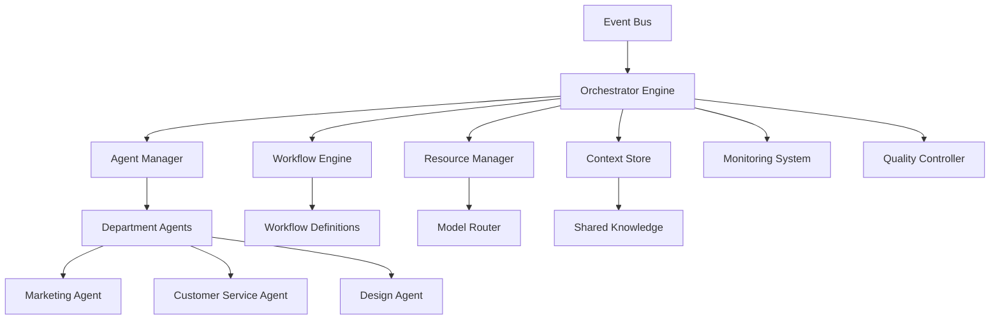

# Multi-Agent Orchestrator Specification
## AI Departments Platform

**Version:** 1.0  
**Date:** 2025-09-13  
**Owner:** Felipe PM + Claude  
**Status:** APPROVED  

---

## Orchestrator Overview

### Core Purpose
The Multi-Agent Orchestrator is the central intelligence system that coordinates AI agents across different departments, manages workflows, handles inter-agent communication, and optimizes resource allocation for maximum efficiency and business value.

### Key Responsibilities
- **Agent Lifecycle Management**: Deploy, monitor, scale, and retire agents
- **Workflow Orchestration**: Coordinate complex multi-agent workflows
- **Resource Optimization**: Intelligent load balancing and cost management
- **Context Sharing**: Enable agents to share knowledge and insights
- **Quality Assurance**: Monitor output quality and trigger improvements

### Architecture Principles
- **Event-Driven**: Reactive to business events and triggers
- **Fault-Tolerant**: Graceful degradation and automatic recovery
- **Scalable**: Handle thousands of organizations efficiently
- **Observable**: Comprehensive monitoring and debugging capabilities

---

## System Architecture

### Core Components


### Technology Stack
```yaml
orchestrator_stack:
  core_framework: Python + AsyncIO
  workflow_engine: Temporal.io
  message_queue: Redis Streams
  state_management: PostgreSQL + Redis
  monitoring: OpenTelemetry + Prometheus
  
  ai_frameworks:
    - LangGraph (workflow definitions)
    - CrewAI (multi-agent coordination)
    - LangChain (agent building blocks)
    
  deployment:
    platform: Google Cloud Run
    scaling: Auto-scaling based on events
    persistence: Cloud SQL + Memorystore
```

---

## Agent Management System

### Agent Lifecycle
```python
# Agent lifecycle management
class AgentManager:
    def __init__(self):
        self.registry = AgentRegistry()
        self.health_monitor = HealthMonitor()
        self.resource_allocator = ResourceAllocator()
    
    async def deploy_agent(
        self, 
        organization_id: str, 
        agent_config: AgentConfig
    ) -> Agent:
        """Deploy a new agent for an organization"""
        
        # Validate configuration
        await self.validate_agent_config(agent_config)
        
        # Allocate resources
        resources = await self.resource_allocator.allocate(
            agent_config.resource_requirements
        )
        
        # Create agent instance
        agent = await self.create_agent_instance(
            organization_id=organization_id,
            config=agent_config,
            resources=resources
        )
        
        # Register agent
        await self.registry.register(agent)
        
        # Start health monitoring
        await self.health_monitor.start_monitoring(agent)
        
        # Initialize agent with context
        await self.initialize_agent_context(agent, organization_id)
        
        return agent
    
    async def scale_agent(
        self, 
        agent_id: str, 
        target_instances: int
    ) -> None:
        """Scale agent instances based on load"""
        
        current_instances = await self.registry.get_instance_count(agent_id)
        
        if target_instances > current_instances:
            # Scale up
            for _ in range(target_instances - current_instances):
                await self.spawn_agent_instance(agent_id)
        elif target_instances < current_instances:
            # Scale down
            instances_to_remove = current_instances - target_instances
            await self.terminate_agent_instances(agent_id, instances_to_remove)
    
    async def retire_agent(self, agent_id: str) -> None:
        """Gracefully retire an agent"""
        
        agent = await self.registry.get_agent(agent_id)
        
        # Stop accepting new work
        await agent.set_status(AgentStatus.DRAINING)
        
        # Wait for current work to complete
        await agent.wait_for_completion(timeout=300)  # 5 minutes
        
        # Save final state
        await self.save_agent_state(agent)
        
        # Cleanup resources
        await self.resource_allocator.deallocate(agent.resources)
        
        # Remove from registry
        await self.registry.unregister(agent_id)
```

### Agent Configuration Schema
```yaml
agent_config_schema:
  metadata:
    name: string              # "Social Media Agent"
    type: string              # "marketing.social_media"
    version: string           # "1.2.0"
    
  capabilities:
    - content_generation
    - scheduling
    - engagement_analysis
    
  resource_requirements:
    memory_mb: 512
    cpu_cores: 0.5
    max_concurrent_tasks: 10
    
  ai_models:
    primary: "gpt-4-turbo"
    fallback: "gpt-3.5-turbo"
    
  triggers:
    - type: schedule
      expression: "0 9 * * *"  # Daily at 9 AM
    - type: webhook
      source: "instagram"
    - type: event
      event_type: "content_approval_needed"
      
  dependencies:
    - knowledge_base_agent
    - brand_guidelines_agent
    
  outputs:
    - social_media_posts
    - engagement_reports
    - content_calendar_updates
```

---

## Workflow Orchestration Engine

### Workflow Definition Language
```python
# Using LangGraph for workflow definition
from langgraph import StateGraph, END

class ContentCreationWorkflow:
    def __init__(self):
        self.workflow = StateGraph(ContentState)
        self.build_workflow()
    
    def build_workflow(self):
        # Define workflow steps
        self.workflow.add_node("research_trends", self.research_trends)
        self.workflow.add_node("generate_content", self.generate_content)
        self.workflow.add_node("review_content", self.review_content)
        self.workflow.add_node("schedule_post", self.schedule_post)
        self.workflow.add_node("human_review", self.human_review)
        
        # Define workflow edges
        self.workflow.add_edge("research_trends", "generate_content")
        self.workflow.add_edge("generate_content", "review_content")
        
        # Conditional edges based on quality score
        self.workflow.add_conditional_edges(
            "review_content",
            self.should_require_human_review,
            {
                True: "human_review",
                False: "schedule_post"
            }
        )
        
        self.workflow.add_edge("human_review", "schedule_post")
        self.workflow.add_edge("schedule_post", END)
        
        # Set entry point
        self.workflow.set_entry_point("research_trends")
        
        # Compile workflow
        self.app = self.workflow.compile()
    
    async def research_trends(self, state: ContentState) -> ContentState:
        """Research current trends for content inspiration"""
        trends_agent = await self.get_agent("trends_researcher")
        
        trends = await trends_agent.research_trends(
            business_type=state.business_type,
            target_audience=state.target_audience,
            timeframe="last_7_days"
        )
        
        state.trends = trends
        return state
    
    async def generate_content(self, state: ContentState) -> ContentState:
        """Generate content based on trends and brand guidelines"""
        content_agent = await self.get_agent("content_generator")
        
        content = await content_agent.generate_post(
            trends=state.trends,
            brand_guidelines=state.brand_guidelines,
            content_type=state.content_type
        )
        
        state.generated_content = content
        return state
    
    async def should_require_human_review(
        self, 
        state: ContentState
    ) -> bool:
        """Determine if human review is needed"""
        
        # Require human review if:
        # - Quality score is below threshold
        # - Content mentions sensitive topics
        # - Brand alignment score is low
        
        quality_threshold = 0.8
        brand_alignment_threshold = 0.7
        
        needs_review = (
            state.generated_content.quality_score < quality_threshold or
            state.generated_content.brand_alignment < brand_alignment_threshold or
            self.contains_sensitive_content(state.generated_content.text)
        )
        
        return needs_review
```

### Complex Multi-Agent Workflows
```yaml
# Customer service escalation workflow
customer_service_workflow:
  name: "customer_service_escalation"
  trigger: "incoming_customer_message"
  
  steps:
    1_initial_analysis:
      agent: sentiment_analyzer
      input: customer_message
      output: sentiment_analysis
      
    2_intent_classification:
      agent: intent_classifier
      input: customer_message
      output: intent_classification
      
    3_knowledge_base_search:
      agent: knowledge_retriever
      input: [customer_message, intent_classification]
      output: relevant_knowledge
      
    4_response_generation:
      agent: response_generator
      input: [customer_message, sentiment_analysis, relevant_knowledge]
      output: draft_response
      
    5_quality_check:
      agent: quality_controller
      input: draft_response
      output: quality_assessment
      
    6_decision_point:
      type: conditional
      condition: quality_assessment.confidence > 0.8
      if_true: send_response
      if_false: escalate_to_human
      
    7a_send_response:
      agent: message_sender
      input: draft_response
      output: sent_confirmation
      
    7b_escalate_to_human:
      agent: escalation_manager
      input: [customer_message, draft_response, quality_assessment]
      output: escalation_ticket
      
  error_handling:
    retry_attempts: 3
    fallback_action: escalate_to_human
    timeout_seconds: 30
```

---

## Inter-Agent Communication

### Message Passing System
```python
# Inter-agent communication framework
class InterAgentMessaging:
    def __init__(self):
        self.message_bus = MessageBus()
        self.routing_table = RoutingTable()
        self.serializer = MessageSerializer()
    
    async def send_message(
        self,
        from_agent: str,
        to_agent: str,
        message_type: str,
        payload: dict,
        priority: Priority = Priority.NORMAL
    ) -> MessageId:
        """Send message between agents"""
        
        message = Message(
            id=self.generate_message_id(),
            from_agent=from_agent,
            to_agent=to_agent,
            message_type=message_type,
            payload=payload,
            priority=priority,
            timestamp=datetime.utcnow(),
            correlation_id=self.get_correlation_id()
        )
        
        # Serialize message
        serialized = await self.serializer.serialize(message)
        
        # Route message
        routing_key = self.routing_table.get_routing_key(to_agent)
        
        # Send via message bus
        await self.message_bus.publish(routing_key, serialized, priority)
        
        # Log for debugging
        await self.log_message(message)
        
        return message.id
    
    async def broadcast_message(
        self,
        from_agent: str,
        message_type: str,
        payload: dict,
        target_departments: List[str] = None
    ) -> List[MessageId]:
        """Broadcast message to multiple agents"""
        
        if target_departments:
            target_agents = await self.get_agents_by_departments(
                target_departments
            )
        else:
            target_agents = await self.get_all_active_agents()
        
        message_ids = []
        for agent in target_agents:
            if agent != from_agent:  # Don't send to self
                msg_id = await self.send_message(
                    from_agent=from_agent,
                    to_agent=agent,
                    message_type=message_type,
                    payload=payload
                )
                message_ids.append(msg_id)
        
        return message_ids
    
    async def request_response(
        self,
        from_agent: str,
        to_agent: str,
        request_type: str,
        payload: dict,
        timeout_seconds: int = 30
    ) -> dict:
        """Send request and wait for response"""
        
        correlation_id = self.generate_correlation_id()
        
        # Send request
        await self.send_message(
            from_agent=from_agent,
            to_agent=to_agent,
            message_type=request_type,
            payload={**payload, 'correlation_id': correlation_id},
            priority=Priority.HIGH
        )
        
        # Wait for response
        response = await self.wait_for_response(
            correlation_id=correlation_id,
            timeout_seconds=timeout_seconds
        )
        
        return response
```

### Context Sharing Framework
```python
# Shared context management
class ContextManager:
    def __init__(self):
        self.context_store = ContextStore()
        self.access_control = AccessController()
        self.versioning = VersionManager()
    
    async def share_context(
        self,
        organization_id: str,
        context_type: str,
        context_data: dict,
        sharing_policy: SharingPolicy
    ) -> ContextId:
        """Share context between agents"""
        
        context = Context(
            id=self.generate_context_id(),
            organization_id=organization_id,
            type=context_type,
            data=context_data,
            created_by=sharing_policy.source_agent,
            access_permissions=sharing_policy.permissions,
            expiry_time=sharing_policy.expiry_time,
            version=1
        )
        
        # Store context
        await self.context_store.store(context)
        
        # Grant access to specified agents
        for agent_id in sharing_policy.allowed_agents:
            await self.access_control.grant_access(
                context_id=context.id,
                agent_id=agent_id,
                permissions=sharing_policy.permissions[agent_id]
            )
        
        # Notify relevant agents
        await self.notify_context_available(context, sharing_policy.allowed_agents)
        
        return context.id
    
    async def get_context(
        self,
        context_id: ContextId,
        requesting_agent: str
    ) -> Context:
        """Retrieve shared context"""
        
        # Check access permissions
        has_access = await self.access_control.check_access(
            context_id=context_id,
            agent_id=requesting_agent
        )
        
        if not has_access:
            raise UnauthorizedAccessError(
                f"Agent {requesting_agent} cannot access context {context_id}"
            )
        
        # Retrieve context
        context = await self.context_store.get(context_id)
        
        # Log access for auditing
        await self.log_context_access(context_id, requesting_agent)
        
        return context
    
    async def update_context(
        self,
        context_id: ContextId,
        updates: dict,
        updating_agent: str
    ) -> Context:
        """Update shared context"""
        
        # Check write permissions
        can_write = await self.access_control.check_write_access(
            context_id=context_id,
            agent_id=updating_agent
        )
        
        if not can_write:
            raise UnauthorizedWriteError(
                f"Agent {updating_agent} cannot update context {context_id}"
            )
        
        # Create new version
        current_context = await self.context_store.get(context_id)
        new_version = current_context.version + 1
        
        updated_context = current_context.copy()
        updated_context.data.update(updates)
        updated_context.version = new_version
        updated_context.updated_by = updating_agent
        updated_context.updated_at = datetime.utcnow()
        
        # Store new version
        await self.context_store.store(updated_context)
        
        # Notify subscribers of update
        await self.notify_context_updated(context_id, new_version)
        
        return updated_context
```

---

## Resource Management & Optimization

### Dynamic Resource Allocation
```python
# Resource management system
class ResourceManager:
    def __init__(self):
        self.resource_pool = ResourcePool()
        self.load_balancer = LoadBalancer()
        self.cost_optimizer = CostOptimizer()
        self.predictor = LoadPredictor()
    
    async def allocate_resources(
        self,
        organization_id: str,
        agent_type: str,
        workload_prediction: dict
    ) -> ResourceAllocation:
        """Dynamically allocate resources based on predicted load"""
        
        # Get historical usage patterns
        usage_history = await self.get_usage_history(
            organization_id, agent_type
        )
        
        # Predict resource needs
        predicted_load = await self.predictor.predict_load(
            usage_history=usage_history,
            workload_prediction=workload_prediction,
            time_horizon_hours=24
        )
        
        # Calculate optimal resource allocation
        optimal_allocation = await self.cost_optimizer.optimize_allocation(
            predicted_load=predicted_load,
            cost_constraints=await self.get_cost_constraints(organization_id),
            performance_requirements=await self.get_sla_requirements(
                organization_id, agent_type
            )
        )
        
        # Allocate resources
        allocation = await self.resource_pool.allocate(optimal_allocation)
        
        # Setup monitoring
        await self.setup_resource_monitoring(allocation)
        
        return allocation
    
    async def rebalance_resources(self) -> None:
        """Periodically rebalance resources across agents"""
        
        # Get current resource utilization
        utilization_stats = await self.get_utilization_stats()
        
        # Identify over/under-utilized resources
        rebalancing_opportunities = self.identify_rebalancing_opportunities(
            utilization_stats
        )
        
        for opportunity in rebalancing_opportunities:
            if opportunity.type == "scale_down":
                await self.scale_down_agent(
                    agent_id=opportunity.agent_id,
                    target_resources=opportunity.target_allocation
                )
            elif opportunity.type == "scale_up":
                await self.scale_up_agent(
                    agent_id=opportunity.agent_id,
                    additional_resources=opportunity.additional_resources
                )
            elif opportunity.type == "migrate":
                await self.migrate_agent_workload(
                    from_agent=opportunity.source_agent,
                    to_agent=opportunity.target_agent,
                    workload_percentage=opportunity.migration_percentage
                )
        
        # Update resource allocation records
        await self.update_allocation_records(rebalancing_opportunities)
```

### AI Model Routing & Optimization
```python
# Intelligent model routing
class ModelRouter:
    def __init__(self):
        self.model_registry = ModelRegistry()
        self.performance_tracker = PerformanceTracker()
        self.cost_tracker = CostTracker()
        self.quality_assessor = QualityAssessor()
    
    async def route_request(
        self,
        task_type: str,
        context: TaskContext,
        organization_preferences: dict
    ) -> ModelSelection:
        """Route AI request to optimal model"""
        
        # Get available models for task type
        available_models = await self.model_registry.get_models_for_task(
            task_type
        )
        
        # Get real-time performance metrics
        performance_metrics = await self.performance_tracker.get_current_metrics(
            models=available_models,
            time_window_minutes=15
        )
        
        # Calculate cost for each model
        cost_estimates = {}
        for model in available_models:
            cost_estimates[model] = await self.cost_tracker.estimate_cost(
                model=model,
                estimated_tokens=context.estimated_tokens,
                organization_id=context.organization_id
            )
        
        # Get quality requirements
        quality_requirements = self.get_quality_requirements(
            task_type, organization_preferences
        )
        
        # Score each model
        model_scores = {}
        for model in available_models:
            score = self.calculate_model_score(
                model=model,
                performance=performance_metrics[model],
                cost=cost_estimates[model],
                quality_requirements=quality_requirements,
                context=context
            )
            model_scores[model] = score
        
        # Select best model
        selected_model = max(model_scores.items(), key=lambda x: x[1])[0]
        
        # Check capacity and fallback if needed
        if not await self.check_model_capacity(selected_model):
            selected_model = await self.get_fallback_model(
                original_model=selected_model,
                available_models=available_models,
                model_scores=model_scores
            )
        
        return ModelSelection(
            model=selected_model,
            confidence=model_scores[selected_model],
            reasoning=self.get_selection_reasoning(
                selected_model, model_scores, context
            )
        )
    
    def calculate_model_score(
        self,
        model: str,
        performance: PerformanceMetrics,
        cost: float,
        quality_requirements: dict,
        context: TaskContext
    ) -> float:
        """Calculate composite score for model selection"""
        
        # Weighted scoring factors
        weights = {
            'quality': 0.4,
            'speed': 0.25,
            'cost': 0.25,
            'reliability': 0.1
        }
        
        # Normalize metrics to 0-1 scale
        quality_score = min(performance.quality_score / quality_requirements['min_quality'], 1.0)
        speed_score = min(quality_requirements['max_latency'] / performance.avg_latency, 1.0)
        cost_score = min(quality_requirements['max_cost'] / cost, 1.0)
        reliability_score = performance.success_rate
        
        # Calculate weighted score
        composite_score = (
            weights['quality'] * quality_score +
            weights['speed'] * speed_score +
            weights['cost'] * cost_score +
            weights['reliability'] * reliability_score
        )
        
        # Apply context-specific bonuses
        if context.priority == Priority.HIGH:
            # Prefer higher quality and speed for high priority tasks
            composite_score += 0.1 * (quality_score + speed_score) / 2
        
        if context.organization_tier == 'enterprise':
            # Enterprise customers get premium model preference
            if model in self.get_premium_models():
                composite_score += 0.05
        
        return composite_score
```

---

## Quality Assurance & Monitoring

### Output Quality Monitoring
```python
# Quality assurance system
class QualityController:
    def __init__(self):
        self.quality_metrics = QualityMetrics()
        self.feedback_collector = FeedbackCollector()
        self.improvement_engine = ImprovementEngine()
        self.alert_system = AlertSystem()
    
    async def assess_output_quality(
        self,
        agent_output: AgentOutput,
        quality_criteria: QualityCriteria
    ) -> QualityAssessment:
        """Assess the quality of agent output"""
        
        assessment = QualityAssessment()
        
        # Content quality checks
        assessment.content_quality = await self.assess_content_quality(
            agent_output.content, quality_criteria.content_requirements
        )
        
        # Brand alignment check
        assessment.brand_alignment = await self.assess_brand_alignment(
            agent_output.content, quality_criteria.brand_guidelines
        )
        
        # Factual accuracy check
        assessment.factual_accuracy = await self.assess_factual_accuracy(
            agent_output.content, quality_criteria.fact_check_level
        )
        
        # Tone and style check
        assessment.tone_consistency = await self.assess_tone_consistency(
            agent_output.content, quality_criteria.tone_requirements
        )
        
        # Safety and compliance check
        assessment.safety_compliance = await self.assess_safety_compliance(
            agent_output.content, quality_criteria.safety_requirements
        )
        
        # Calculate overall quality score
        assessment.overall_score = self.calculate_overall_quality_score(
            assessment
        )
        
        # Generate recommendations if score is low
        if assessment.overall_score < quality_criteria.minimum_score:
            assessment.recommendations = await self.generate_improvement_recommendations(
                agent_output, assessment, quality_criteria
            )
        
        # Store assessment for learning
        await self.store_quality_assessment(agent_output.id, assessment)
        
        return assessment
    
    async def monitor_quality_trends(
        self,
        organization_id: str,
        time_period: timedelta
    ) -> QualityTrendReport:
        """Monitor quality trends over time"""
        
        # Collect quality data
        quality_data = await self.quality_metrics.get_quality_data(
            organization_id=organization_id,
            start_time=datetime.utcnow() - time_period,
            end_time=datetime.utcnow()
        )
        
        # Analyze trends
        trends = self.analyze_quality_trends(quality_data)
        
        # Identify issues
        issues = self.identify_quality_issues(trends)
        
        # Generate recommendations
        recommendations = await self.generate_quality_recommendations(
            trends, issues
        )
        
        # Create alerts if needed
        if self.should_alert_quality_degradation(trends):
            await self.alert_system.send_quality_alert(
                organization_id=organization_id,
                trends=trends,
                issues=issues
            )
        
        return QualityTrendReport(
            organization_id=organization_id,
            time_period=time_period,
            trends=trends,
            issues=issues,
            recommendations=recommendations
        )
```

### Performance Monitoring
```python
# Orchestrator performance monitoring
class OrchestrationMonitor:
    def __init__(self):
        self.metrics_collector = MetricsCollector()
        self.alert_manager = AlertManager()
        self.dashboard = Dashboard()
    
    async def collect_orchestration_metrics(self) -> OrchestrationMetrics:
        """Collect comprehensive orchestration metrics"""
        
        metrics = OrchestrationMetrics()
        
        # Agent metrics
        metrics.agent_metrics = await self.collect_agent_metrics()
        
        # Workflow metrics
        metrics.workflow_metrics = await self.collect_workflow_metrics()
        
        # Resource utilization
        metrics.resource_metrics = await self.collect_resource_metrics()
        
        # Inter-agent communication metrics
        metrics.communication_metrics = await self.collect_communication_metrics()
        
        # Quality metrics
        metrics.quality_metrics = await self.collect_quality_metrics()
        
        # Cost metrics
        metrics.cost_metrics = await self.collect_cost_metrics()
        
        return metrics
    
    async def detect_anomalies(
        self,
        metrics: OrchestrationMetrics
    ) -> List[Anomaly]:
        """Detect anomalies in orchestration performance"""
        
        anomalies = []
        
        # Check for unusual resource consumption
        if metrics.resource_metrics.cpu_usage > 0.8:
            anomalies.append(Anomaly(
                type="high_cpu_usage",
                severity="warning",
                description="CPU usage is above 80%",
                metric_value=metrics.resource_metrics.cpu_usage
            ))
        
        # Check for high error rates
        if metrics.agent_metrics.error_rate > 0.05:
            anomalies.append(Anomaly(
                type="high_error_rate",
                severity="critical",
                description="Agent error rate is above 5%",
                metric_value=metrics.agent_metrics.error_rate
            ))
        
        # Check for workflow failures
        if metrics.workflow_metrics.failure_rate > 0.1:
            anomalies.append(Anomaly(
                type="workflow_failures",
                severity="high",
                description="Workflow failure rate is above 10%",
                metric_value=metrics.workflow_metrics.failure_rate
            ))
        
        # Check for quality degradation
        if metrics.quality_metrics.avg_quality_score < 0.7:
            anomalies.append(Anomaly(
                type="quality_degradation",
                severity="high",
                description="Average quality score is below 70%",
                metric_value=metrics.quality_metrics.avg_quality_score
            ))
        
        return anomalies
    
    async def handle_anomalies(self, anomalies: List[Anomaly]) -> None:
        """Handle detected anomalies"""
        
        for anomaly in anomalies:
            if anomaly.severity == "critical":
                # Immediate action required
                await self.trigger_emergency_response(anomaly)
            elif anomaly.severity == "high":
                # Alert ops team
                await self.alert_manager.send_high_priority_alert(anomaly)
            elif anomaly.severity == "warning":
                # Log and monitor
                await self.log_warning(anomaly)
                await self.increase_monitoring_frequency(anomaly.type)
```

---

## Orchestrator Configuration

### Organization-Specific Orchestration
```yaml
# Organization orchestration configuration
organization_orchestration:
  organization_id: "org_123"
  
  agent_deployment:
    marketing:
      agents:
        - type: social_media_agent
          priority: high
          schedule: "daily"
        - type: email_marketing_agent
          priority: medium
          schedule: "weekly"
          
    customer_service:
      agents:
        - type: whatsapp_responder
          priority: critical
          trigger: "real_time"
        - type: faq_updater
          priority: low
          schedule: "weekly"
          
  workflow_preferences:
    content_approval_required: true
    human_review_threshold: 0.8
    auto_publish_enabled: false
    
  resource_limits:
    max_concurrent_agents: 10
    daily_ai_budget_usd: 50
    max_requests_per_hour: 1000
    
  quality_requirements:
    minimum_quality_score: 0.75
    brand_alignment_threshold: 0.8
    safety_check_required: true
    
  integration_preferences:
    preferred_ai_provider: "openai"
    fallback_ai_provider: "anthropic"
    messaging_platform: "whatsapp"
    social_platforms: ["instagram", "facebook"]
```

### Global Orchestrator Settings
```yaml
# Global orchestrator configuration
orchestrator_config:
  performance:
    max_concurrent_workflows: 1000
    workflow_timeout_minutes: 30
    agent_response_timeout_seconds: 60
    
  resource_management:
    auto_scaling_enabled: true
    scale_up_threshold: 0.8
    scale_down_threshold: 0.3
    min_agents_per_type: 1
    max_agents_per_type: 50
    
  quality_control:
    quality_check_percentage: 100
    human_review_percentage: 10
    feedback_collection_enabled: true
    
  monitoring:
    metrics_collection_interval_seconds: 30
    health_check_interval_seconds: 60
    anomaly_detection_enabled: true
    
  cost_optimization:
    model_routing_enabled: true
    response_caching_enabled: true
    cost_aware_scheduling: true
    
  security:
    context_encryption_enabled: true
    agent_isolation_enabled: true
    audit_logging_enabled: true
```

---

## Error Handling & Recovery

### Fault Tolerance Mechanisms
```python
# Fault tolerance and recovery system
class FaultTolerance:
    def __init__(self):
        self.circuit_breaker = CircuitBreaker()
        self.retry_policy = RetryPolicy()
        self.fallback_manager = FallbackManager()
        self.health_checker = HealthChecker()
    
    async def handle_agent_failure(
        self,
        failed_agent_id: str,
        failure_type: FailureType,
        context: FailureContext
    ) -> RecoveryResult:
        """Handle agent failure with appropriate recovery strategy"""
        
        recovery_strategy = self.determine_recovery_strategy(
            failure_type, context
        )
        
        if recovery_strategy == RecoveryStrategy.RESTART:
            return await self.restart_agent(failed_agent_id)
        
        elif recovery_strategy == RecoveryStrategy.FAILOVER:
            return await self.failover_to_backup_agent(
                failed_agent_id, context
            )
        
        elif recovery_strategy == RecoveryStrategy.GRACEFUL_DEGRADATION:
            return await self.enable_graceful_degradation(
                failed_agent_id, context
            )
        
        elif recovery_strategy == RecoveryStrategy.ESCALATE:
            return await self.escalate_to_human_operator(
                failed_agent_id, failure_type, context
            )
    
    async def implement_circuit_breaker(
        self,
        agent_id: str,
        failure_threshold: int = 5,
        recovery_timeout: int = 60
    ) -> None:
        """Implement circuit breaker pattern for failing agents"""
        
        failure_count = await self.get_recent_failure_count(agent_id)
        
        if failure_count >= failure_threshold:
            # Open circuit - stop sending requests to failing agent
            await self.circuit_breaker.open_circuit(agent_id)
            
            # Set recovery timer
            await self.schedule_recovery_attempt(
                agent_id, recovery_timeout
            )
            
            # Route traffic to healthy agents
            await self.reroute_traffic(agent_id)
        
        elif self.circuit_breaker.is_half_open(agent_id):
            # Test if agent has recovered
            health_check_result = await self.health_checker.check_agent(
                agent_id
            )
            
            if health_check_result.is_healthy:
                # Close circuit - agent has recovered
                await self.circuit_breaker.close_circuit(agent_id)
                await self.restore_traffic(agent_id)
            else:
                # Keep circuit open, extend recovery timer
                await self.extend_recovery_timer(agent_id)
```

---

## Performance Optimization

### Caching Strategies
```python
# Multi-level caching system
class CacheManager:
    def __init__(self):
        self.memory_cache = MemoryCache()
        self.redis_cache = RedisCache()
        self.persistent_cache = PersistentCache()
    
    async def get_cached_response(
        self,
        cache_key: str,
        cache_level: CacheLevel = CacheLevel.ALL
    ) -> CacheResult:
        """Get cached response with multi-level fallback"""
        
        # Try memory cache first (fastest)
        if cache_level in [CacheLevel.MEMORY, CacheLevel.ALL]:
            result = await self.memory_cache.get(cache_key)
            if result.hit:
                await self.update_cache_stats("memory", "hit")
                return result
        
        # Try Redis cache (medium speed)
        if cache_level in [CacheLevel.REDIS, CacheLevel.ALL]:
            result = await self.redis_cache.get(cache_key)
            if result.hit:
                # Promote to memory cache
                await self.memory_cache.set(
                    cache_key, result.data, ttl=300  # 5 minutes
                )
                await self.update_cache_stats("redis", "hit")
                return result
        
        # Try persistent cache (slowest)
        if cache_level in [CacheLevel.PERSISTENT, CacheLevel.ALL]:
            result = await self.persistent_cache.get(cache_key)
            if result.hit:
                # Promote to higher levels
                await self.redis_cache.set(
                    cache_key, result.data, ttl=3600  # 1 hour
                )
                await self.memory_cache.set(
                    cache_key, result.data, ttl=300  # 5 minutes
                )
                await self.update_cache_stats("persistent", "hit")
                return result
        
        # Cache miss
        await self.update_cache_stats("all", "miss")
        return CacheResult(hit=False, data=None)
    
    async def cache_response(
        self,
        cache_key: str,
        data: dict,
        ttl_memory: int = 300,
        ttl_redis: int = 3600,
        ttl_persistent: int = 86400
    ) -> None:
        """Cache response at all appropriate levels"""
        
        # Determine cache levels based on data characteristics
        cache_levels = self.determine_cache_levels(data)
        
        if CacheLevel.MEMORY in cache_levels:
            await self.memory_cache.set(cache_key, data, ttl_memory)
        
        if CacheLevel.REDIS in cache_levels:
            await self.redis_cache.set(cache_key, data, ttl_redis)
        
        if CacheLevel.PERSISTENT in cache_levels:
            await self.persistent_cache.set(cache_key, data, ttl_persistent)
```

---

## Deployment & Scaling

### Horizontal Scaling Strategy
```yaml
# Orchestrator scaling configuration
scaling_strategy:
  auto_scaling:
    enabled: true
    metrics:
      - cpu_utilization
      - memory_usage
      - queue_length
      - response_time
    
    scale_up_policy:
      threshold_cpu: 70%
      threshold_memory: 80%
      threshold_queue: 100_messages
      threshold_response_time: 5_seconds
      cooldown_period: 300_seconds
      
    scale_down_policy:
      threshold_cpu: 30%
      threshold_memory: 40%
      threshold_queue: 10_messages
      threshold_response_time: 1_second
      cooldown_period: 600_seconds
      
  resource_limits:
    min_instances: 2
    max_instances: 50
    cpu_per_instance: "2000m"
    memory_per_instance: "4Gi"
    
  load_balancing:
    algorithm: "weighted_round_robin"
    health_check_path: "/health"
    health_check_interval: 30_seconds
    unhealthy_threshold: 3
    healthy_threshold: 2
```

---

**Document Status:** Multi-agent orchestrator specification complete with comprehensive architecture, workflow management, resource optimization, and monitoring capabilities. Ready for implementation and deployment.**