# Sequence Diagrams
## AI Departments Platform

**Version:** 1.0  
**Date:** 2025-09-13  
**Owner:** Felipe PM + Claude  
**Status:** APPROVED  

---

## Core User Flows

### 1. User Registration & Onboarding

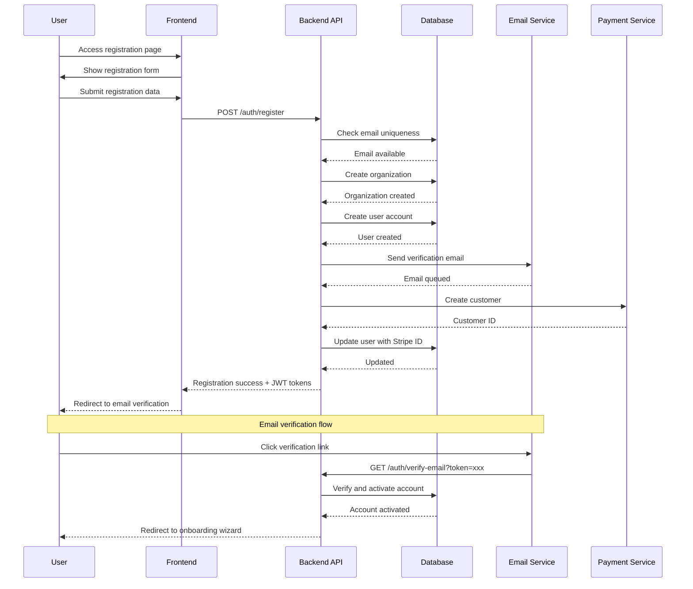
```mermaid
sequenceDiagram
    participant U as User
    participant FE as Frontend
    participant API as Backend API
    participant DB as Database
    participant Email as Email Service
    participant Stripe as Payment Service

    U->>FE: Access registration page
    FE->>U: Show registration form
    
    U->>FE: Submit registration data
    FE->>API: POST /auth/register
    
    API->>DB: Check email uniqueness
    DB-->>API: Email available
    
    API->>DB: Create organization
    DB-->>API: Organization created
    
    API->>DB: Create user account
    DB-->>API: User created
    
    API->>Email: Send verification email
    Email-->>API: Email queued
    
    API->>Stripe: Create customer
    Stripe-->>API: Customer ID
    
    API->>DB: Update user with Stripe ID
    DB-->>API: Updated
    
    API-->>FE: Registration success + JWT tokens
    FE-->>U: Redirect to email verification
    
    Note over U,Email: Email verification flow
    U->>Email: Click verification link
    Email->>API: GET /auth/verify-email?token=xxx
    API->>DB: Verify and activate account
    DB-->>API: Account activated
    API-->>U: Redirect to onboarding wizard
```

### 2. Business Template Selection & Setup

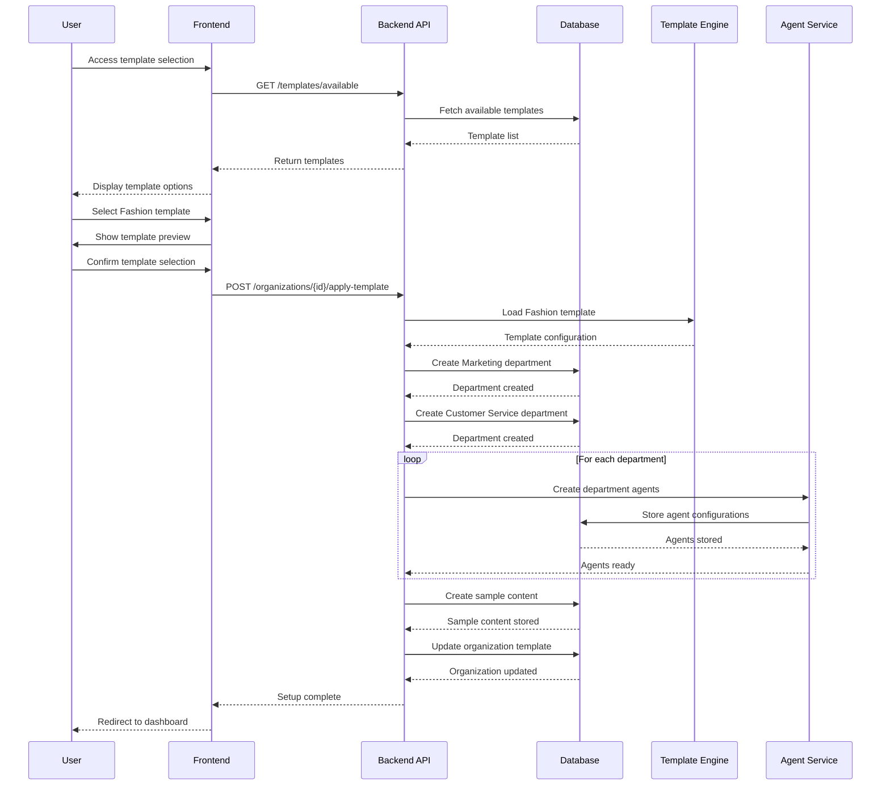
```mermaid
sequenceDiagram
    participant U as User
    participant FE as Frontend
    participant API as Backend API
    participant DB as Database
    participant Templates as Template Engine
    participant Agents as Agent Service

    U->>FE: Access template selection
    FE->>API: GET /templates/available
    API->>DB: Fetch available templates
    DB-->>API: Template list
    API-->>FE: Return templates
    FE-->>U: Display template options

    U->>FE: Select Fashion template
    FE->>U: Show template preview
    
    U->>FE: Confirm template selection
    FE->>API: POST /organizations/{id}/apply-template
    
    API->>Templates: Load Fashion template
    Templates-->>API: Template configuration
    
    API->>DB: Create Marketing department
    DB-->>API: Department created
    
    API->>DB: Create Customer Service department
    DB-->>API: Department created
    
    loop For each department
        API->>Agents: Create department agents
        Agents->>DB: Store agent configurations
        DB-->>Agents: Agents stored
        Agents-->>API: Agents ready
    end
    
    API->>DB: Create sample content
    DB-->>API: Sample content stored
    
    API->>DB: Update organization template
    DB-->>API: Organization updated
    
    API-->>FE: Setup complete
    FE-->>U: Redirect to dashboard
```

### 3. WhatsApp Message Flow (Customer Service)

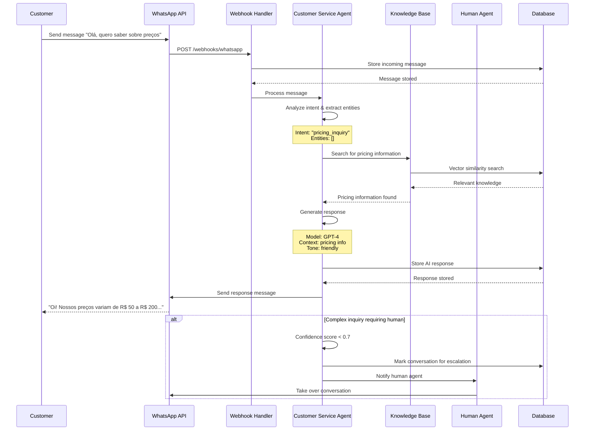
```mermaid
sequenceDiagram
    participant C as Customer
    participant WA as WhatsApp API
    participant Webhook as Webhook Handler
    participant CX as Customer Service Agent
    participant KB as Knowledge Base
    participant Human as Human Agent
    participant DB as Database

    C->>WA: Send message "Olá, quero saber sobre preços"
    WA->>Webhook: POST /webhooks/whatsapp
    
    Webhook->>DB: Store incoming message
    DB-->>Webhook: Message stored
    
    Webhook->>CX: Process message
    
    CX->>CX: Analyze intent & extract entities
    Note over CX: Intent: "pricing_inquiry"<br/>Entities: []
    
    CX->>KB: Search for pricing information
    KB->>DB: Vector similarity search
    DB-->>KB: Relevant knowledge
    KB-->>CX: Pricing information found
    
    CX->>CX: Generate response
    Note over CX: Model: GPT-4<br/>Context: pricing info<br/>Tone: friendly
    
    CX->>DB: Store AI response
    DB-->>CX: Response stored
    
    CX->>WA: Send response message
    WA-->>C: "Oi! Nossos preços variam de R$ 50 a R$ 200..."
    
    alt Complex inquiry requiring human
        CX->>CX: Confidence score < 0.7
        CX->>DB: Mark conversation for escalation
        CX->>Human: Notify human agent
        Human->>WA: Take over conversation
    end
```

### 4. Social Media Content Generation & Publishing

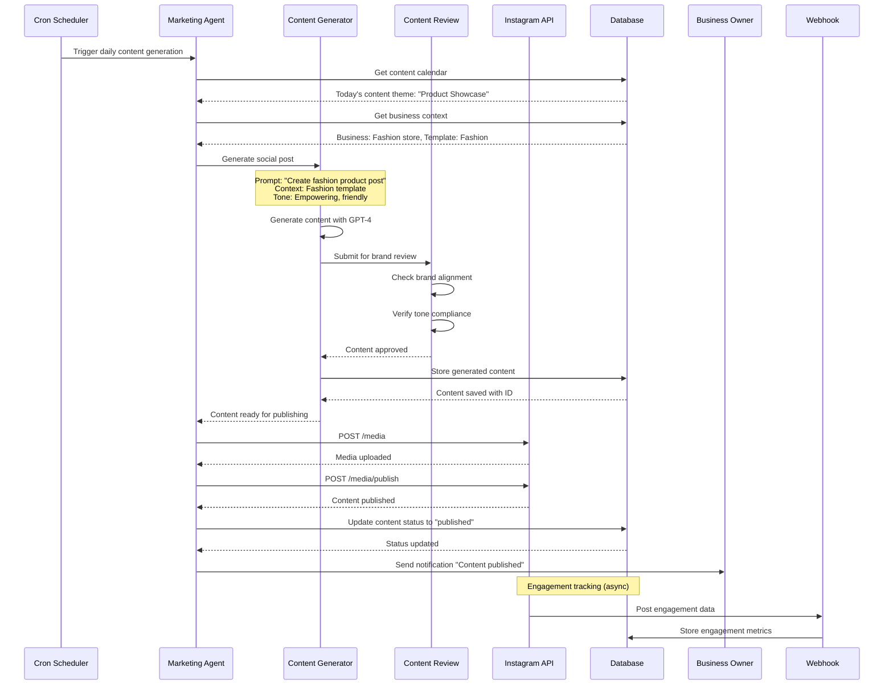
```mermaid
sequenceDiagram
    participant Scheduler as Cron Scheduler
    participant Marketing as Marketing Agent
    participant ContentGen as Content Generator
    participant Review as Content Review
    participant Instagram as Instagram API
    participant DB as Database
    participant User as Business Owner

    Scheduler->>Marketing: Trigger daily content generation
    
    Marketing->>DB: Get content calendar
    DB-->>Marketing: Today's content theme: "Product Showcase"
    
    Marketing->>DB: Get business context
    DB-->>Marketing: Business: Fashion store, Template: Fashion
    
    Marketing->>ContentGen: Generate social post
    Note over ContentGen: Prompt: "Create fashion product post"<br/>Context: Fashion template<br/>Tone: Empowering, friendly
    
    ContentGen->>ContentGen: Generate content with GPT-4
    
    ContentGen->>Review: Submit for brand review
    Review->>Review: Check brand alignment
    Review->>Review: Verify tone compliance
    Review-->>ContentGen: Content approved
    
    ContentGen->>DB: Store generated content
    DB-->>ContentGen: Content saved with ID
    
    ContentGen-->>Marketing: Content ready for publishing
    
    Marketing->>Instagram: POST /media
    Instagram-->>Marketing: Media uploaded
    
    Marketing->>Instagram: POST /media/publish
    Instagram-->>Marketing: Content published
    
    Marketing->>DB: Update content status to "published"
    DB-->>Marketing: Status updated
    
    Marketing->>User: Send notification "Content published"
    
    Note over Instagram,DB: Engagement tracking (async)
    Instagram->>Webhook: Post engagement data
    Webhook->>DB: Store engagement metrics
```

### 5. AI Agent Orchestration Flow

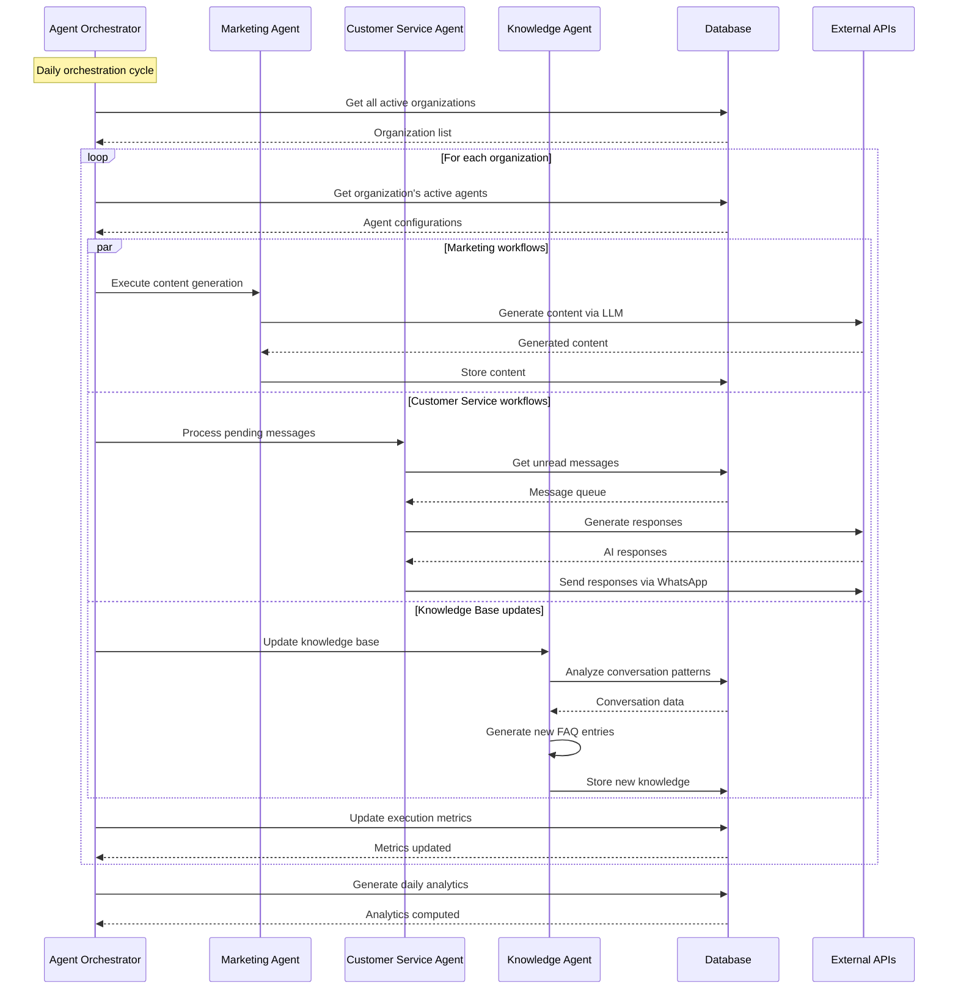
```mermaid
sequenceDiagram
    participant Orchestrator as Agent Orchestrator
    participant Marketing as Marketing Agent
    participant CX as Customer Service Agent
    participant Knowledge as Knowledge Agent
    participant DB as Database
    participant APIs as External APIs

    Note over Orchestrator: Daily orchestration cycle
    
    Orchestrator->>DB: Get all active organizations
    DB-->>Orchestrator: Organization list
    
    loop For each organization
        Orchestrator->>DB: Get organization's active agents
        DB-->>Orchestrator: Agent configurations
        
        par Marketing workflows
            Orchestrator->>Marketing: Execute content generation
            Marketing->>APIs: Generate content via LLM
            APIs-->>Marketing: Generated content
            Marketing->>DB: Store content
        and Customer Service workflows
            Orchestrator->>CX: Process pending messages
            CX->>DB: Get unread messages
            DB-->>CX: Message queue
            CX->>APIs: Generate responses
            APIs-->>CX: AI responses
            CX->>APIs: Send responses via WhatsApp
        and Knowledge Base updates
            Orchestrator->>Knowledge: Update knowledge base
            Knowledge->>DB: Analyze conversation patterns
            DB-->>Knowledge: Conversation data
            Knowledge->>Knowledge: Generate new FAQ entries
            Knowledge->>DB: Store new knowledge
        end
        
        Orchestrator->>DB: Update execution metrics
        DB-->>Orchestrator: Metrics updated
    end
    
    Orchestrator->>DB: Generate daily analytics
    DB-->>Orchestrator: Analytics computed
```

### 6. Integration Setup & Authentication

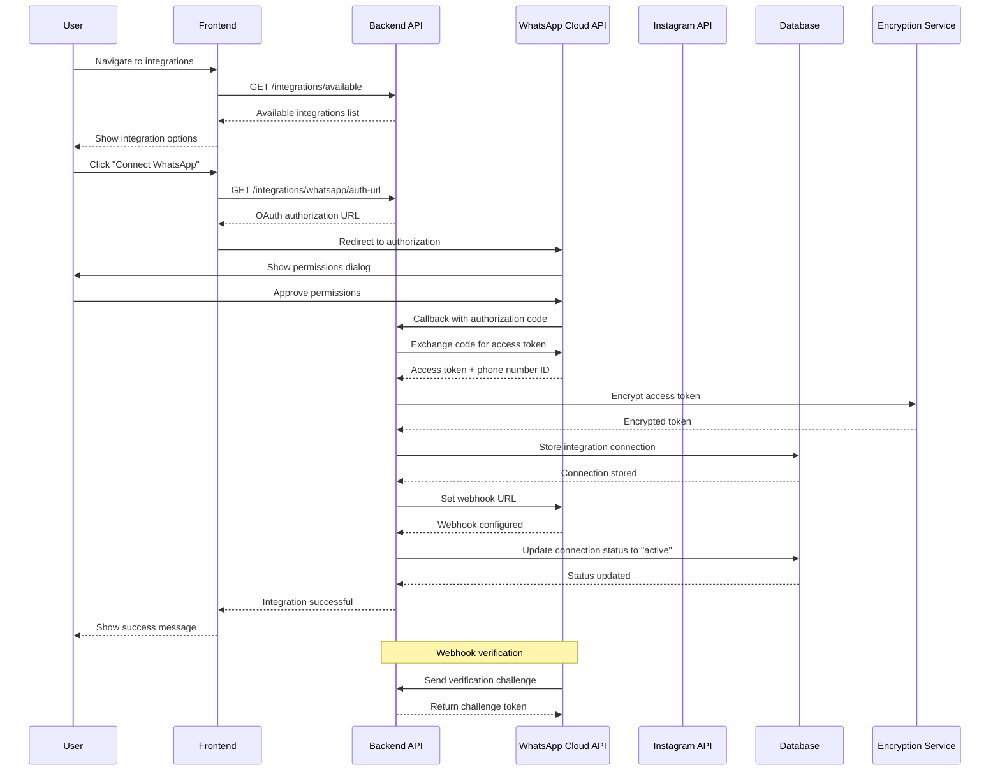
```mermaid
sequenceDiagram
    participant U as User
    participant FE as Frontend
    participant API as Backend API
    participant WhatsApp as WhatsApp Cloud API
    participant Instagram as Instagram API
    participant DB as Database
    participant Encrypt as Encryption Service

    U->>FE: Navigate to integrations
    FE->>API: GET /integrations/available
    API-->>FE: Available integrations list
    FE-->>U: Show integration options

    U->>FE: Click "Connect WhatsApp"
    FE->>API: GET /integrations/whatsapp/auth-url
    API-->>FE: OAuth authorization URL
    FE->>WhatsApp: Redirect to authorization
    
    WhatsApp->>U: Show permissions dialog
    U->>WhatsApp: Approve permissions
    WhatsApp->>API: Callback with authorization code
    
    API->>WhatsApp: Exchange code for access token
    WhatsApp-->>API: Access token + phone number ID
    
    API->>Encrypt: Encrypt access token
    Encrypt-->>API: Encrypted token
    
    API->>DB: Store integration connection
    DB-->>API: Connection stored
    
    API->>WhatsApp: Set webhook URL
    WhatsApp-->>API: Webhook configured
    
    API->>DB: Update connection status to "active"
    DB-->>API: Status updated
    
    API-->>FE: Integration successful
    FE-->>U: Show success message
    
    Note over API,WhatsApp: Webhook verification
    WhatsApp->>API: Send verification challenge
    API-->>WhatsApp: Return challenge token
```

### 7. Billing & Subscription Management

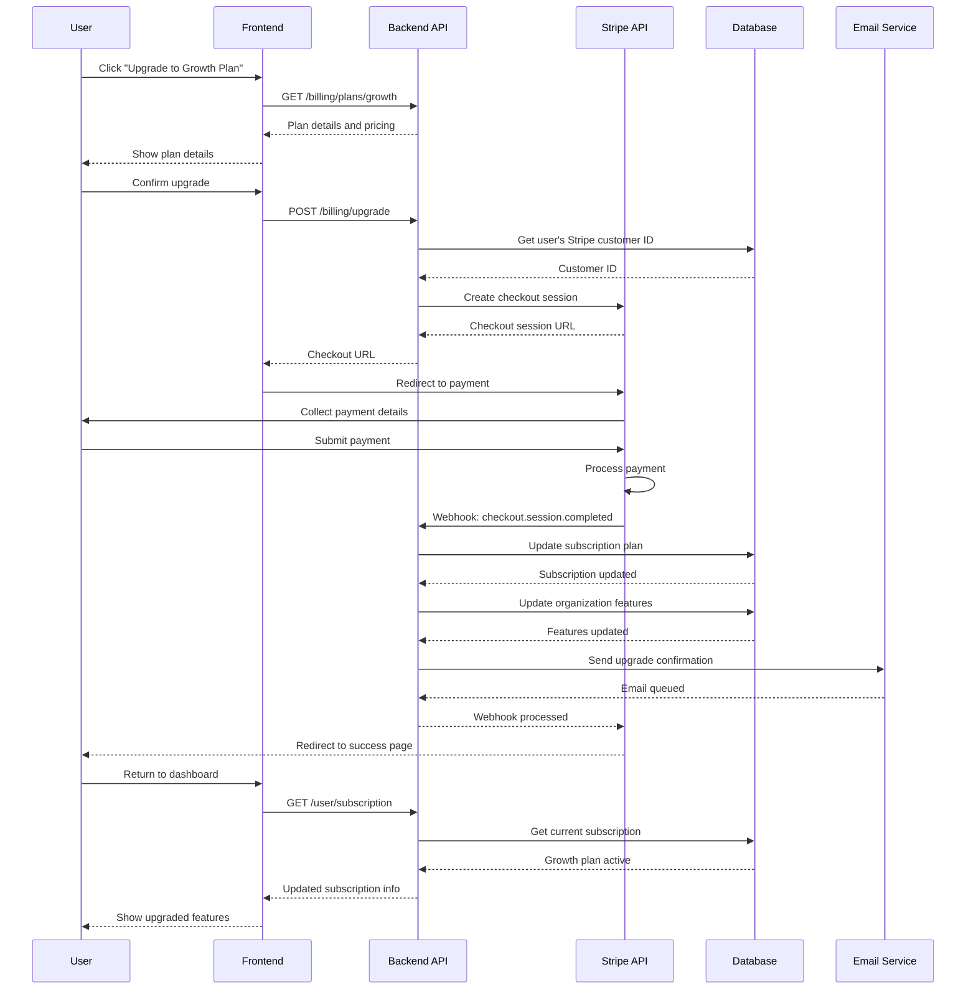
```mermaid
sequenceDiagram
    participant U as User
    participant FE as Frontend
    participant API as Backend API
    participant Stripe as Stripe API
    participant DB as Database
    participant Email as Email Service

    U->>FE: Click "Upgrade to Growth Plan"
    FE->>API: GET /billing/plans/growth
    API-->>FE: Plan details and pricing
    FE-->>U: Show plan details

    U->>FE: Confirm upgrade
    FE->>API: POST /billing/upgrade
    
    API->>DB: Get user's Stripe customer ID
    DB-->>API: Customer ID
    
    API->>Stripe: Create checkout session
    Stripe-->>API: Checkout session URL
    
    API-->>FE: Checkout URL
    FE->>Stripe: Redirect to payment
    
    Stripe->>U: Collect payment details
    U->>Stripe: Submit payment
    Stripe->>Stripe: Process payment
    
    Stripe->>API: Webhook: checkout.session.completed
    API->>DB: Update subscription plan
    DB-->>API: Subscription updated
    
    API->>DB: Update organization features
    DB-->>API: Features updated
    
    API->>Email: Send upgrade confirmation
    Email-->>API: Email queued
    
    API-->>Stripe: Webhook processed
    
    Stripe-->>U: Redirect to success page
    U->>FE: Return to dashboard
    FE->>API: GET /user/subscription
    API->>DB: Get current subscription
    DB-->>API: Growth plan active
    API-->>FE: Updated subscription info
    FE-->>U: Show upgraded features
```

### 8. Error Handling & Recovery

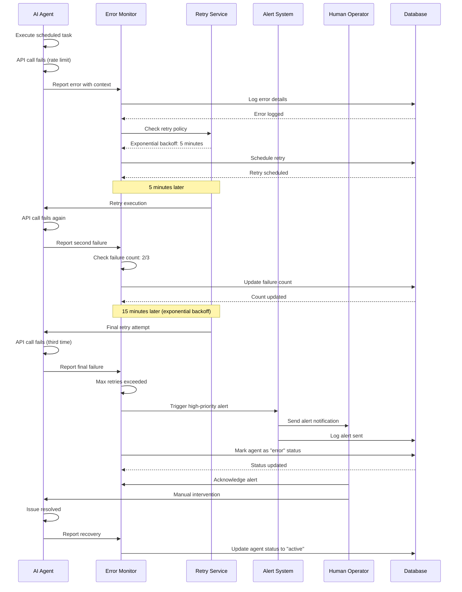
```mermaid
sequenceDiagram
    participant Agent as AI Agent
    participant Monitor as Error Monitor
    participant Retry as Retry Service
    participant Alert as Alert System
    participant Human as Human Operator
    participant DB as Database

    Agent->>Agent: Execute scheduled task
    Agent->>Agent: API call fails (rate limit)
    
    Agent->>Monitor: Report error with context
    Monitor->>DB: Log error details
    DB-->>Monitor: Error logged
    
    Monitor->>Retry: Check retry policy
    Retry-->>Monitor: Exponential backoff: 5 minutes
    
    Monitor->>DB: Schedule retry
    DB-->>Monitor: Retry scheduled
    
    Note over Monitor,Retry: 5 minutes later
    Retry->>Agent: Retry execution
    Agent->>Agent: API call fails again
    
    Agent->>Monitor: Report second failure
    Monitor->>Monitor: Check failure count: 2/3
    
    Monitor->>DB: Update failure count
    DB-->>Monitor: Count updated
    
    Note over Monitor,Retry: 15 minutes later (exponential backoff)
    Retry->>Agent: Final retry attempt
    Agent->>Agent: API call fails (third time)
    
    Agent->>Monitor: Report final failure
    Monitor->>Monitor: Max retries exceeded
    
    Monitor->>Alert: Trigger high-priority alert
    Alert->>Human: Send alert notification
    Alert->>DB: Log alert sent
    
    Monitor->>DB: Mark agent as "error" status
    DB-->>Monitor: Status updated
    
    Human->>Monitor: Acknowledge alert
    Human->>Agent: Manual intervention
    Agent->>Agent: Issue resolved
    Agent->>Monitor: Report recovery
    Monitor->>DB: Update agent status to "active"
```

---

## Integration Flows

### 9. WhatsApp Cloud API Integration

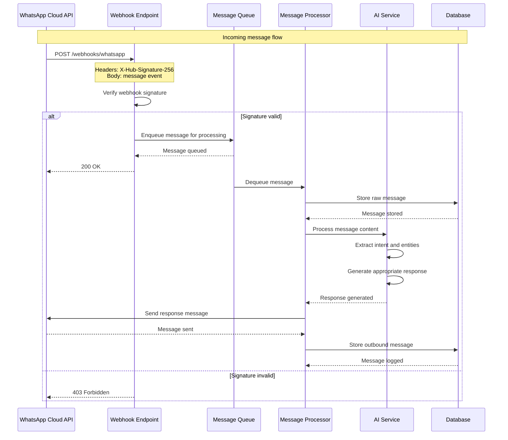
```mermaid
sequenceDiagram
    participant WA as WhatsApp Cloud API
    participant Webhook as Webhook Endpoint
    participant Queue as Message Queue
    participant Processor as Message Processor
    participant AI as AI Service
    participant DB as Database

    Note over WA,DB: Incoming message flow
    
    WA->>Webhook: POST /webhooks/whatsapp
    Note over Webhook: Headers: X-Hub-Signature-256<br/>Body: message event
    
    Webhook->>Webhook: Verify webhook signature
    
    alt Signature valid
        Webhook->>Queue: Enqueue message for processing
        Queue-->>Webhook: Message queued
        Webhook-->>WA: 200 OK
        
        Queue->>Processor: Dequeue message
        Processor->>DB: Store raw message
        DB-->>Processor: Message stored
        
        Processor->>AI: Process message content
        AI->>AI: Extract intent and entities
        AI->>AI: Generate appropriate response
        AI-->>Processor: Response generated
        
        Processor->>WA: Send response message
        WA-->>Processor: Message sent
        
        Processor->>DB: Store outbound message
        DB-->>Processor: Message logged
        
    else Signature invalid
        Webhook-->>WA: 403 Forbidden
    end
```

### 10. Instagram Graph API Content Publishing

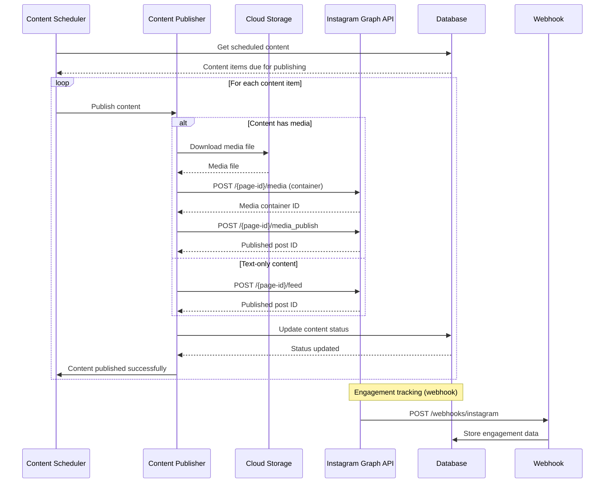
```mermaid
sequenceDiagram
    participant Scheduler as Content Scheduler
    participant Publisher as Content Publisher
    participant Storage as Cloud Storage
    participant Instagram as Instagram Graph API
    participant DB as Database

    Scheduler->>DB: Get scheduled content
    DB-->>Scheduler: Content items due for publishing
    
    loop For each content item
        Scheduler->>Publisher: Publish content
        
        alt Content has media
            Publisher->>Storage: Download media file
            Storage-->>Publisher: Media file
            
            Publisher->>Instagram: POST /{page-id}/media (container)
            Instagram-->>Publisher: Media container ID
            
            Publisher->>Instagram: POST /{page-id}/media_publish
            Instagram-->>Publisher: Published post ID
            
        else Text-only content
            Publisher->>Instagram: POST /{page-id}/feed
            Instagram-->>Publisher: Published post ID
        end
        
        Publisher->>DB: Update content status
        DB-->>Publisher: Status updated
        
        Publisher->>Scheduler: Content published successfully
    end
    
    Note over Instagram,DB: Engagement tracking (webhook)
    Instagram->>Webhook: POST /webhooks/instagram
    Webhook->>DB: Store engagement data
```

### 11. Payment Processing (Stripe + MercadoPago)

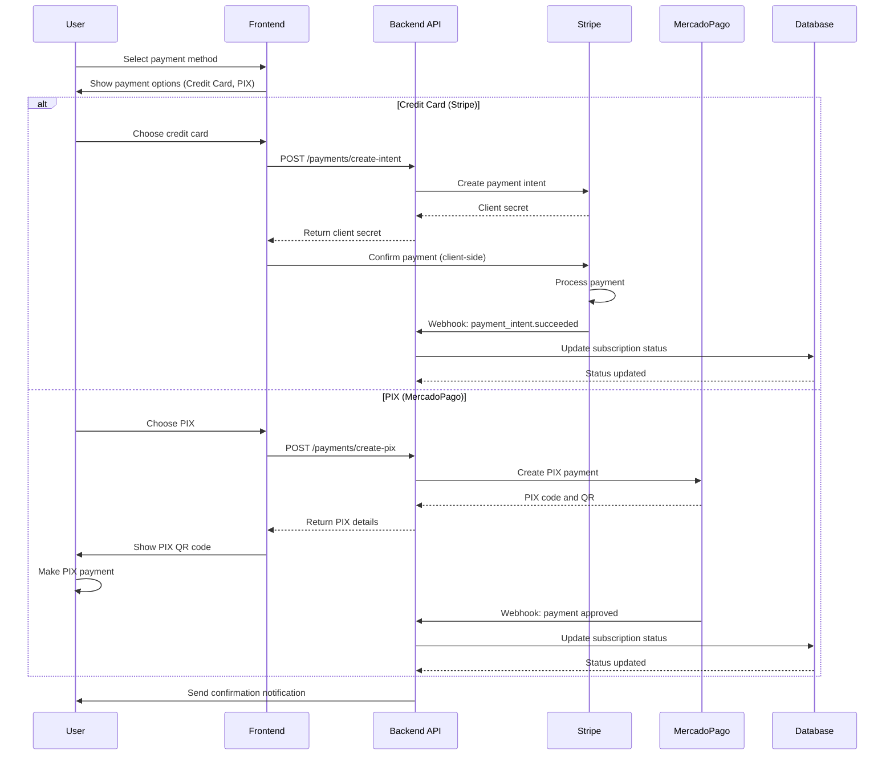
```mermaid
sequenceDiagram
    participant User as User
    participant FE as Frontend
    participant API as Backend API
    participant Stripe as Stripe
    participant MP as MercadoPago
    participant DB as Database

    User->>FE: Select payment method
    FE->>User: Show payment options (Credit Card, PIX)
    
    alt Credit Card (Stripe)
        User->>FE: Choose credit card
        FE->>API: POST /payments/create-intent
        API->>Stripe: Create payment intent
        Stripe-->>API: Client secret
        API-->>FE: Return client secret
        
        FE->>Stripe: Confirm payment (client-side)
        Stripe->>Stripe: Process payment
        Stripe->>API: Webhook: payment_intent.succeeded
        
        API->>DB: Update subscription status
        DB-->>API: Status updated
        
    else PIX (MercadoPago)
        User->>FE: Choose PIX
        FE->>API: POST /payments/create-pix
        API->>MP: Create PIX payment
        MP-->>API: PIX code and QR
        API-->>FE: Return PIX details
        
        FE->>User: Show PIX QR code
        User->>User: Make PIX payment
        MP->>API: Webhook: payment approved
        
        API->>DB: Update subscription status
        DB-->>API: Status updated
    end
    
    API->>User: Send confirmation notification
```

---

## Error & Edge Case Flows

### 12. Rate Limiting & Throttling

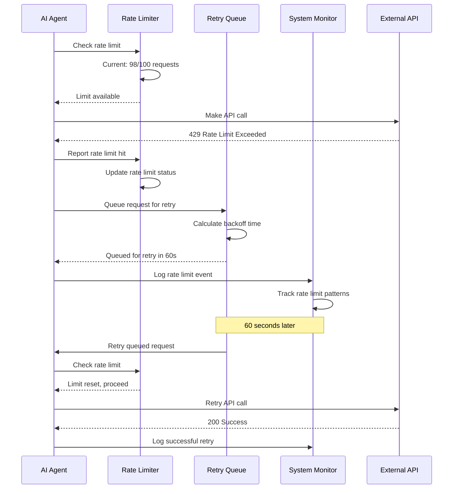
```mermaid
sequenceDiagram
    participant Agent as AI Agent
    participant RateLimit as Rate Limiter
    participant Queue as Retry Queue
    participant Monitor as System Monitor
    participant External as External API

    Agent->>RateLimit: Check rate limit
    RateLimit->>RateLimit: Current: 98/100 requests
    RateLimit-->>Agent: Limit available
    
    Agent->>External: Make API call
    External-->>Agent: 429 Rate Limit Exceeded
    
    Agent->>RateLimit: Report rate limit hit
    RateLimit->>RateLimit: Update rate limit status
    
    Agent->>Queue: Queue request for retry
    Queue->>Queue: Calculate backoff time
    Queue-->>Agent: Queued for retry in 60s
    
    Agent->>Monitor: Log rate limit event
    Monitor->>Monitor: Track rate limit patterns
    
    Note over Queue,Monitor: 60 seconds later
    Queue->>Agent: Retry queued request
    Agent->>RateLimit: Check rate limit
    RateLimit-->>Agent: Limit reset, proceed
    
    Agent->>External: Retry API call
    External-->>Agent: 200 Success
    
    Agent->>Monitor: Log successful retry
```

### 13. Multi-Tenant Data Isolation

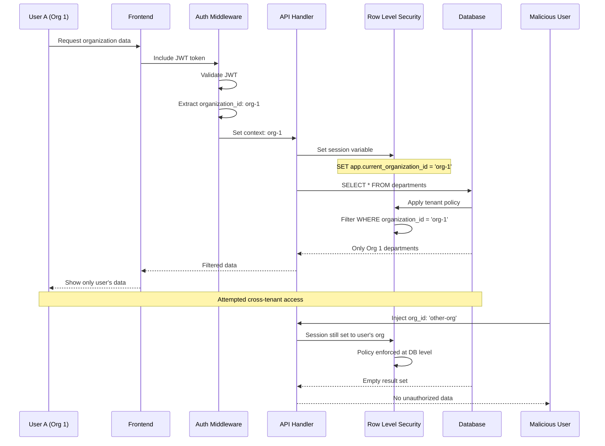
```mermaid
sequenceDiagram
    participant User as User A (Org 1)
    participant FE as Frontend
    participant Auth as Auth Middleware
    participant API as API Handler
    participant RLS as Row Level Security
    participant DB as Database

    User->>FE: Request organization data
    FE->>Auth: Include JWT token
    Auth->>Auth: Validate JWT
    Auth->>Auth: Extract organization_id: org-1
    Auth->>API: Set context: org-1
    
    API->>RLS: Set session variable
    Note over RLS: SET app.current_organization_id = 'org-1'
    
    API->>DB: SELECT * FROM departments
    DB->>RLS: Apply tenant policy
    RLS->>RLS: Filter WHERE organization_id = 'org-1'
    DB-->>API: Only Org 1 departments
    
    API-->>FE: Filtered data
    FE-->>User: Show only user's data
    
    Note over User,DB: Attempted cross-tenant access
    participant Hacker as Malicious User
    Hacker->>API: Inject org_id: 'other-org'
    API->>RLS: Session still set to user's org
    RLS->>RLS: Policy enforced at DB level
    DB-->>API: Empty result set
    API-->>Hacker: No unauthorized data
```

### 14. Content Moderation & Safety

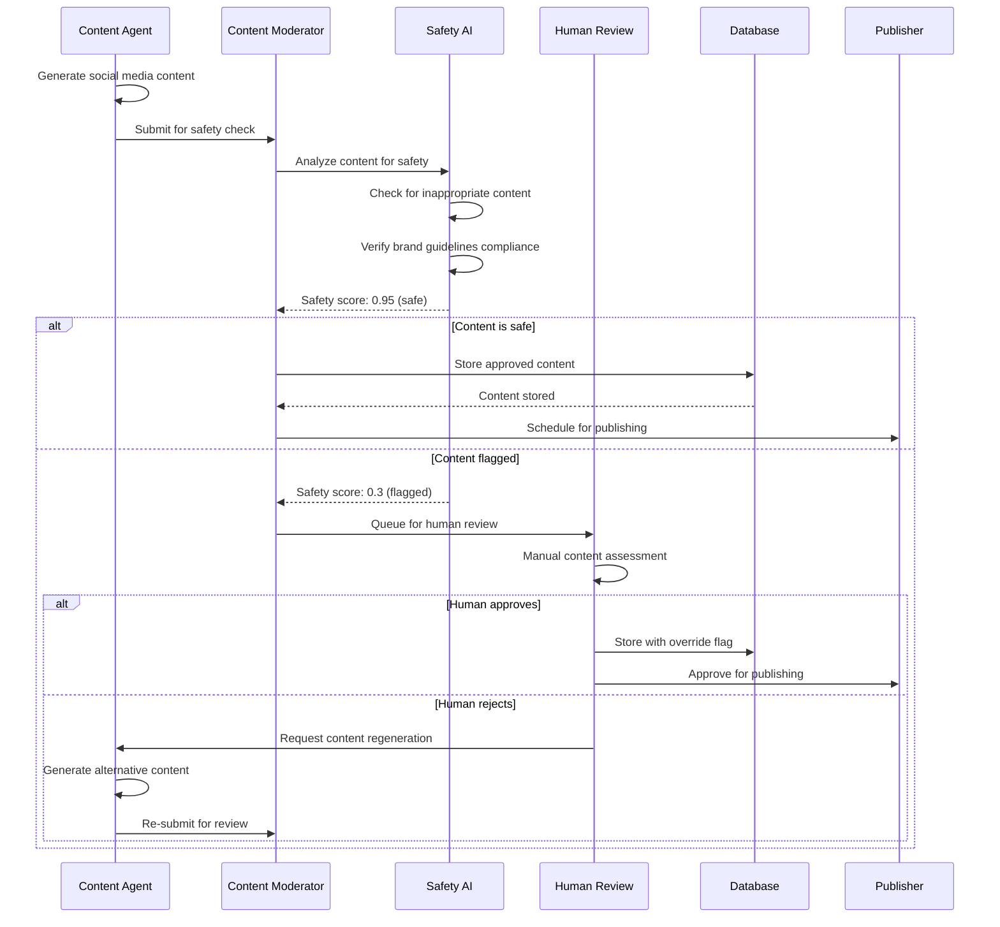
```mermaid
sequenceDiagram
    participant Agent as Content Agent
    participant Moderator as Content Moderator
    participant AI as Safety AI
    participant Review as Human Review
    participant DB as Database
    participant Publish as Publisher

    Agent->>Agent: Generate social media content
    Agent->>Moderator: Submit for safety check
    
    Moderator->>AI: Analyze content for safety
    AI->>AI: Check for inappropriate content
    AI->>AI: Verify brand guidelines compliance
    AI-->>Moderator: Safety score: 0.95 (safe)
    
    alt Content is safe
        Moderator->>DB: Store approved content
        DB-->>Moderator: Content stored
        Moderator->>Publish: Schedule for publishing
        
    else Content flagged
        AI-->>Moderator: Safety score: 0.3 (flagged)
        Moderator->>Review: Queue for human review
        Review->>Review: Manual content assessment
        
        alt Human approves
            Review->>DB: Store with override flag
            Review->>Publish: Approve for publishing
        else Human rejects
            Review->>Agent: Request content regeneration
            Agent->>Agent: Generate alternative content
            Agent->>Moderator: Re-submit for review
        end
    end
```

### 15. System Health Monitoring & Alerting

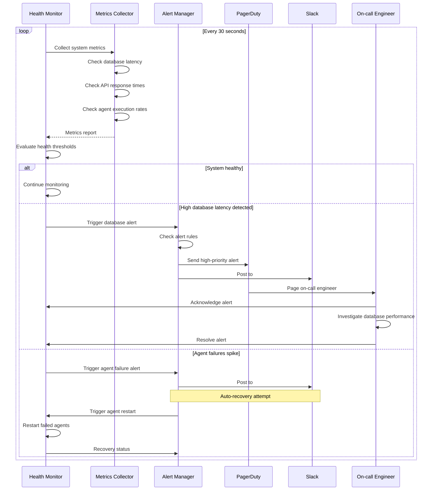
```mermaid
sequenceDiagram
    participant Monitor as Health Monitor
    participant Metrics as Metrics Collector
    participant Alert as Alert Manager
    participant PagerDuty as PagerDuty
    participant Slack as Slack
    participant DBA as On-call Engineer

    loop Every 30 seconds
        Monitor->>Metrics: Collect system metrics
        Metrics->>Metrics: Check database latency
        Metrics->>Metrics: Check API response times
        Metrics->>Metrics: Check agent execution rates
        Metrics-->>Monitor: Metrics report
        
        Monitor->>Monitor: Evaluate health thresholds
        
        alt System healthy
            Monitor->>Monitor: Continue monitoring
            
        else High database latency detected
            Monitor->>Alert: Trigger database alert
            Alert->>Alert: Check alert rules
            Alert->>PagerDuty: Send high-priority alert
            Alert->>Slack: Post to #alerts channel
            
            PagerDuty->>DBA: Page on-call engineer
            DBA->>Monitor: Acknowledge alert
            DBA->>DBA: Investigate database performance
            DBA->>Monitor: Resolve alert
            
        else Agent failures spike
            Monitor->>Alert: Trigger agent failure alert
            Alert->>Slack: Post to #ai-ops channel
            
            Note over Alert,Slack: Auto-recovery attempt
            Alert->>Monitor: Trigger agent restart
            Monitor->>Monitor: Restart failed agents
            Monitor->>Alert: Recovery status
        end
    end
```

---

**Document Status:** Sequence diagrams completed covering all critical user flows, integration patterns, error handling, and system operations. Ready for development reference and system implementation.